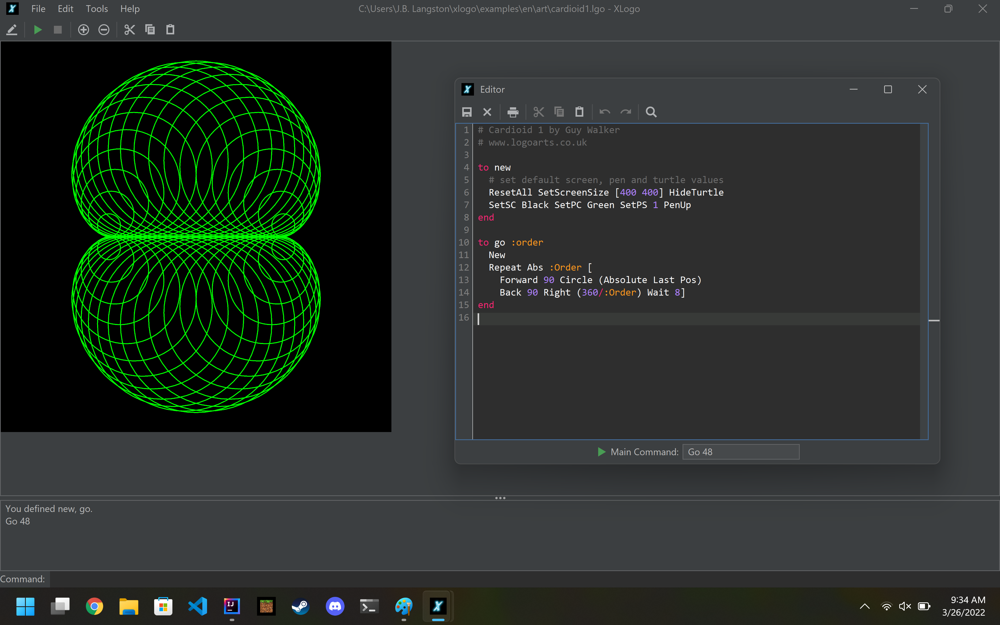

# XLogo

XLogo is a Logo interpreter written in Java and licensed under the [GPL](COPYING.md). It has many extensions relative to other Logo implementations, such as networking, sound, 3D, and animation support.  It supports nine languages: French, English, Spanish, Arabic, Portuguese, German, Esperanto, Galician and Greek.

Logo is a programming language [developed in the 1970's](https://dl.acm.org/doi/pdf/10.1145/3386329) by Wally Feurzeig, Seymour Papert, and Cynthia Solomon. It is an excellent language to begin learning with, as it teaches the basics of things like loops, tests, procedures, etc. Operations on lists and words are also possible. 

The user moves an object called a "turtle" around the screen using commands as simple as forward, back, right, and so on. As it moves, the turtle leaves a trail behind it, and so it is therefore possible to create drawings.  For example, `forward 100 right 90` will first make the turtle move 100 steps forward, and then turn the turtle 90° to the right.  This intuitive graphical approach makes Logo an ideal language for beginners, including children.

## Reboot

Loïc Le Coq originally developed XLogo until 2012. I (J.B. Langston) came across XLogo in 2022 and tried to contact him but got no response. Sadly, I believe he [passed away](https://avis-de-deces.ouest-france.fr/20130306/loic-lecoq-15803) in 2013.  I migrated the original repo to GitHub and started working on some improvements:

- Fix blurry/pixelated scaling on high resolution displays
- Make a nice looking themeable UI using FlatLaf
- Use SVG images for icons, flags, and turtles
- Replace editor with feature-rich RSyntaxTextArea
- Update Java3D dependencies to latest versions
- Fix bugs and improve code quality

This version of XLogo is currently in beta status but is already more usable on modern computers than the original version. It still needs a lot of testing, especially on platforms other than Windows.  If you try it out and have any problems, please [open an issue](https://github.com/jblang/xlogo/issues). If you want to help, check out the [Developer Notes](DEVNOTES.md) to get started.

## Download

Pre-compiled jars available on the [Releases](https://github.com/jblang/xlogo/releases) page. You can also still download the [old version](http://xlogo.tuxfamily.org/en/download-en.html) from the XLogo website.

Note: You will need Java 11 or later on your computer to run XLogo. If you don't already have a compatible JDK installed, [Microsoft](https://docs.microsoft.com/en-us/java/openjdk/download) offers free OpenJDK downloads for Windows, Mac, and Linux.

## Documentation

### Logo Arts

Guy Walker's wonderful [Logo Arts](http://www.cr31.co.uk/logoarts/index.html) website contains many XLogo resources:
- Lots of [Example Programs](http://www.cr31.co.uk/logoarts/prog/top/all.html) with screenshots
- Comprehensive [Primitive Reference](http://www.cr31.co.uk/logoarts/ipt/top/prim.html)
- Excellent [Book Recommendations](http://www.cr31.co.uk/logoarts/ipt/info/books.html)

### XLogo Website

The [XLogo website](http://xlogo.tuxfamily.org/) contains extensive documentation. Reference manuals are available in many languages. Some languages and formats may be more up-to-date than others, and some also have tutorials and other resources.  **Note:** none of the manuals have yet been updated to reflect recent user interface changes, but they are still generally applicable.

I have summarized what's available in the table below:

| Document | English | French | German | Italian | Portuguese | Spanish | Esperanto |
| - | - | - | - | - | - | - | - |
| Reference Manual (online) | [English][man-en] | [French][man-fr] | [German][man-de] | [Italian][man-it] | [Portuguese][man-pt] | [Spanish][man-es] | [Esperanto][man-eo]
| Reference Manual (zipped html) | [English][zip-en] | [French][zip-fr] | [German][zip-de] | [Italian][zip-it] | [Portuguese][zip-pt] | [Spanish][zip-es] | [Esperanto][zip-eo]
| Reference Manual (pdf) | [English][pdf-en] | [French][pdf-fr] | [German][pdf-de] | [Italian][pdf-it] | [Portuguese][pdf-pt] | [Spanish][pdf-es] | [Esperanto][pdf-eo]
| Examples | *[LogoArts][ex-en]* | [French][ex-fr] | | [Italian][ex-it] | [Portuguese][ex-pt] | [Spanish][ex-es] | 
| XLogo Robotics | [English][rob-en] | | | [Italian][rob-it] | [Portuguese][rob-pt] | [Spanish][rob-es] |
| Tutorial (pdf) | | [French][tut-fr] | | | [Portuguese][tut-pt] | [Spanish][tut-es]
| Tutorial (zipped html) | | | | | | [Spanish][ziptut-es]
| Introductory Course | | | | | | [Spanish][course-es]
| Installation (pdf) | [English][ins-en] | [French][ins-fr] | [German][ins-de] |  |  | [Spanish][ins-es] |

[man-en]: https://downloads.tuxfamily.org/xlogo/downloads-en/manual-html-en/manual-en.html
[man-fr]: https://downloads.tuxfamily.org/xlogo/downloads-fr/manual-html-fr/manual-fr.html
[man-de]: https://downloads.tuxfamily.org/xlogo/downloads-de/manual-html-de/manual-de.html
[man-it]: https://downloads.tuxfamily.org/xlogo/downloads-it/manual-html-it/manual-it.html
[man-pt]: https://xlogo.tuxfamily.org/pt/xlogo.htm
[man-es]: https://xlogo.tuxfamily.org/sp/html/manual-sp/index.html
[man-eo]: https://downloads.tuxfamily.org/xlogo/downloads-eo/manual-html-eo/manual-eo.html

[zip-en]: https://downloads.tuxfamily.org/xlogo/downloads-en/manual-html-en.zip
[zip-fr]: https://downloads.tuxfamily.org/xlogo/downloads-fr/manual-html-fr.zip
[zip-de]: https://downloads.tuxfamily.org/xlogo/downloads-de/manual-html-de.zip
[zip-it]: https://downloads.tuxfamily.org/xlogo/downloads-it/manual-html-it.zip
[zip-pt]: https://downloads.tuxfamily.org/xlogo/downloads-pt/xmanualPT3.zip
[zip-es]: https://downloads.tuxfamily.org/xlogo/downloads-sp/manual-html-sp.zip
[zip-eo]: https://downloads.tuxfamily.org/xlogo/downloads-eo/manual-html-eo.zip

[pdf-en]: https://downloads.tuxfamily.org/xlogo/downloads-en/manual-en.pdf
[pdf-fr]: https://downloads.tuxfamily.org/xlogo/downloads-fr/manual-fr.pdf
[pdf-de]: https://downloads.tuxfamily.org/xlogo/downloads-de/manual-de.pdf
[pdf-it]: https://downloads.tuxfamily.org/xlogo/downloads-it/manual-it.pdf
[pdf-pt]: https://downloads.tuxfamily.org/xlogo/downloads-pt/manualPT.pdf
[pdf-es]: https://downloads.tuxfamily.org/xlogo/downloads-sp/manual-sp.pdf
[pdf-eo]: https://downloads.tuxfamily.org/xlogo/downloads-eo/manual-eo.pdf

[ex-en]: http://www.cr31.co.uk/logoarts/prog/top/all.html
[ex-fr]: http://xlogo.tuxfamily.org/fr/examples-fr.html
[ex-de]: https://xlogo.tuxfamily.org/de/examples-de.html
[ex-it]: http://xlogo.tuxfamily.org/it/examples-it.html
[ex-pt]: http://xlogo.tuxfamily.org/pt/examples.html
[ex-es]: http://xlogo.tuxfamily.org/sp/ejemplos.html
[ex-eo]: https://xlogo.tuxfamily.org/eo/examples-eo.html

[rob-en]: https://xlogo.tuxfamily.org/en/robot-en.html
[rob-it]: http://xlogo.tuxfamily.org/it/robot-it.html
[rob-pt]: https://xlogo.tuxfamily.org/pt/robot.html
[rob-es]: https://xlogo.tuxfamily.org/sp/robotica.html

[tut-fr]: http://downloads.tuxfamily.org/xlogo/downloads-fr/tutorial-fr.pdf
[tut-pt]: https://downloads.tuxfamily.org/xlogo/downloads-pt/tutlogo.pdf
[tut-es]: https://downloads.tuxfamily.org/xlogo/downloads-sp/tutorial.pdf

[ziptut-es]: https://downloads.tuxfamily.org/xlogo/downloads-sp/tutorial-html-sp.zip
[course-es]: https://xlogo.tuxfamily.org/sp/curso/curso.html

[ins-en]: https://downloads.tuxfamily.org/xlogo/downloads-en/start-en.pdf
[ins-fr]: https://downloads.tuxfamily.org/xlogo/downloads-fr/start-fr.pdf
[ins-de]: https://downloads.tuxfamily.org/xlogo/downloads-de/start-de.pdf
[ins-es]: https://downloads.tuxfamily.org/xlogo/downloads-sp/start-sp.pdf

[TeX sources](docs) for each language's documentation are available on the XLogo website but have also been added to this 
repo, if available.

## Credits

### Developers

- Loïc Le Coq: Original Developer
- J.B. Langston: Current Maintainer

### Translators

- Loïc Le Coq: French
- Kevin Donnely, Guy Walker: English
- Marcelo Duschkin, Alvaro Valdes Menendez: Spanish
- El Houcine Jarad: Arabic
- Alexandre Soares: Portugese
- Miriam Abresch, Michael Malien: German
- Michel Gaillard, Carlos Enrique, Carleos Artime: Esperanto
- Justo Freire: Galician
- Anastasios Drakopoulos: Greek
- Marco Bascietto: Italian
- David Arso: Catalan
- Jozsef Varga: Hungarian

### Third-party

- [FlatLaf](https://www.formdev.com/flatlaf/): Swing look and feel (Apache license)
- [IntelliJ IDEA](https://jetbrains.design/intellij/resources/icons_list/): SVG Icons (Apache license)
- [Java3D](https://github.com/hharrison/java3d-core): 3D scene graph library (GPL license)
- [Jogamp](https://jogamp.org/): OpenGL libraries (BSD/MIT/Apache license)
- [JavaHelp](https://github.com/javaee/javahelp): Help library (GPL license)
- [JLayer](https://github.com/umjammer/jlayer): MP3 library (LGPL license)
- [RSyntaxTextArea](https://github.com/bobbylight/RSyntaxTextArea), [RSTAUI](https://github.com/bobbylight/RSTAUI) and [AutoComplete](https://github.com/bobbylight/AutoComplete): Syntax-highlighting editor components (BSD license)
- [WikiMedia Commons](https://commons.wikimedia.org/wiki/Main_Page): flag images (Public domain)