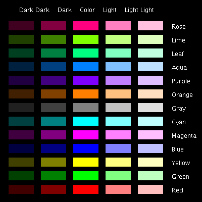

# Colors

| Primitive                          | Alt       | Action                                                      |
| ---------------------------------- | --------- | ----------------------------------------------------------- |
| **Set** **ScreenColor** [rr gg bb] | **SetSC** | **Set** (background) **color** of **screen** to [rr gg bb]. |
| **Set** **PenColor** [rr gg bb]    | **SetPC** | **Set color** of turtle **pen** to [rr gg bb].              |
| **PenPaint**                       | **PPT**   | Set pen to normal **paint** mode and lower pen.             |
| **PenReverse**                     | **PX**    | Set pen to **reverse** color mode and lower pen.            |
| **PenErase**                       | **PE**    | Set pen to screen color and lower pen.                      |
| **FindColor** [xx yy]              | **FC**    | Return **color** of pixel at point xx yy, [rr gg bb]. *     |

Underlined **Set** can be removed from a primitive name in order to return information.   
 eg. **SetHeading** sets the heading of the turtle. **Heading** returns the heading of the turtle.

* turtle position and heading remain unchanged.

Colors are set by a list of the three primary colors of light; red , green and blue . Each color varies in intensity from 0 (min) to 255 (max).

Pen Colors

As well as an [rr gg bb] list, pen and stage color can be set by (but not return) a name or single number.
So, **SetPC 2** = **SetPC Green** = **SetPC [0 255 0]** .

**Standard Colors:**

| Color Name | Index | RGB           |
| ---------- | ----- | ------------- |
| Black      | 0     | `0 0 0`       |
| Red        | 1     | `255 0 0`     |
| Green      | 2     | `0 255 0`     |
| Yellow     | 3     | `255 255 0`   |
| Blue       | 4     | `0 0 255`     |
| Magenta    | 5     | `255 0 255`   |
| Cyan       | 6     | `0 255 255`   |
| White      | 7     | `255 255 255` |
| Gray       | 8     | `128 128 128` |
| LightGray  | 9     | `192 192 192` |
| DarkRed    | 10    | `128 0 0`     |
| DarkGreen  | 11    | `0 128 0`     |
| DarkBlue   | 12    | `0 0 128`     |
| Orange     | 13    | `255 128 0`   |
| Pink       | 14    | `255 175 175` |
| Purple     | 15    | `128 0 255`   |
| Brown      | 16    | `153 102 0`   |

**Alternative Colors:**

By rearranging the values 0, 128 and 255 we can create four more colors besides Orange and Purple. Aqua and Leaf are the most different (useful). Lime is similar to Green and Rose is similar to Magenta. [Aqua](../info/procol.html#aqua) , [Leaf](../info/procol.html#leaf) , [Lime](../info/procol.html#lime) and [Rose](../info/procol.html#rose) are library procedures.

| Color Name | RGB         |
| ---------- | ----------- |
| Aqua       | `0 128 255` |
| Leaf       | `0 255 128` |
| Lime       | `128 255 0` |
| Rose       | `255 0 128` |

Note

1. Aqua, Leaf, Lime and Rose are four extra colors used in many programs. Along with Orange and Purple they comprise the 6 arrangements of values 0, 128 and 255. See [Alternative Colors](../info/colorsalt.md) for more color rgb values.
2. **SetSC** will wash the drawing area and reset the turtle to the home position.
3. **PX** works by subtracting the current pen color from the screen color to generate a 'difference' color. This is then added to colors the pen draws over. So if it draws over the same color as the pen color the result will be the screen color.
