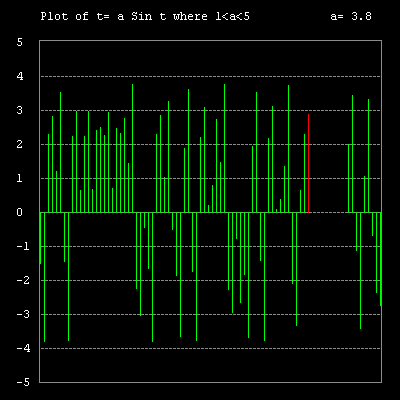

# Chaos


This shows how a simple function can exhibit stable, cyclic and 
chaotic behaviour. The function used is t = a sin t, (in radians). 
The initial value of a is 3.8 and t is 0.2. The next value of t 
is then calculated as 3.8 * Sin 0.2. This value is plotted on a 
graph, then fed back into the function to obtain the next value 
of t.  

The cursor up and down keys allow you to alter the value of a as 
the successive values of t are plotted. These will be stable, cyclic 
or chaotic at certain values of a.

```logo
To New
 # set default screen, pen and turtle values
 ResetAll SetScreenSize [400 400] HideTurtle
 SetSC Black SetPC Green SetPS 1 PenUp
End
To Init
 Make "A 3.8 Make "T 0.2 # starting values
 Make "Delay 10 # reduce to speed up
 Message [Use the Up and Down cursor keys to adjust the value of 'a']
End
To Title
 SetPC White
 SetPos [-160 180] Label [Plot of t= a Sin t where 1<a<5]
 SetPos [130 180] Label [a= 3.8]
 SetPos [-184 -186] For [W -5 5] [Label :W Forward 34]
 SetPC Gray
 SetPos [-161 -182] PenDown Repeat 4 [Forward 342 Right 90]
 SetH 90 For [Y -148 124 34] [
 PenUp SetPos (List Minus 159 :Y)
 Repeat 85 [PenDown Forward 2 PenUp Forward 2]]
End
To Chaos
 SetH 0
 While ["True] [Make "X Minus 160
 Repeat 86 [Make "T :A*Sin (:T*180/Pi)
 PenUp SetPos (List :X Minus 12) PenDown
 SetPC Red Forward :T*34 Wait :Delay Refresh
 SetPC Green Back :T*34
 Make "XX :X+40
 If :XX> 180 [Make "XX :XX-344]
 PenUp SetPos (List :XX Minus 181) PenDown
 SetPC Black Forward 340
 KeyIP Make "X :X +4]]
End
To KeyIP
 If Key? [
 Make "Char ReadChar
 If :Char=-38 [Make "A :A+0.1 Make "PC 7]
 If :Char=-40 [Make "A :A-0.1 Make "PC 7]
 If :A>5 [Make 
 "A 5 Make "PC 1]
 If :A<1 [Make 
 "A 1 Make "PC 1]
 Score :A :PC]
End
To Score :A :PC
 PenUp SetPos [126 184] SetH 90 SetPC Black SetPW 10
 PenDown Forward 56
 PenUp SetPos [130 180] SetH 0 SetPC :PC SetPW 1
 Label Sentence [a=] :A
End
To Go
 New Animation Init Title Chaos
End
```

By varying the value of 'a', the following states can be seen. 
 
 As 'a' is decreased from 3.2 to 3.1, the plot is 'locked' either positive or negative, depending on the sign of the last plot.
