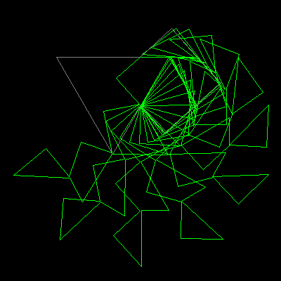

# Dudeney's Disection


Invented by master puzzler Henry Earnest Dudeney in around 1905. 
The four pieces are hinged at their corners. They rotate to 
form a square or an equalateral triangle.

```logo
To New
 # set default screen, pen and turtle values
 ResetAll SetScreenSize [400 400] HideTurtle
 SetSC Black SetPC Green SetPS 1 PenUp
End
To SqTri
 PenUp SetXY 0 50 SetH -150 PenDown
 Forward 80 Right 120 Forward 160
 Right 120 Forward 119.28 Left 42.12 Forward 60 Right 90
 Forward 104 Right 90 Forward 106 Right 90 Forward 53
End
To Shape0
 PenUp SetXY 0 50 SetH -42.12 PenDown
 Forward 52 Right 90 Forward 45.5 Right 42.12
 Forward 41 Right 120 Forward 80
End
To Shape1
 PenUp SetXY 0 50 SetH -150 -:OffSet PenDown
 Forward 80 Right 120 Forward 80 Shape2
 Right 180+:OffSet Forward 60.5 Right 90 Forward 52
End
To Shape2
 Left :OffSet Forward 80 Right 120 Forward 39 Shape3
 Right 180 +:OffSet Forward 52 Right 90 Forward 46
End
To Shape3
 Left :OffSet Forward 80 Right 137.88 
 Forward 60 Right 90 Forward 52
End
To Paint :Angle
 Make "OffSet 90*(1+Cos :Angle)
 SetPC Gray SqTri SetPC Green Shape0 Shape1
 Refresh Wait 15 Wash
End
To Go
 New Animation While ["True] [
 For [Angle 0 180 9] [Paint :Angle]
 For [Angle 180 0 -9] [Paint :Angle]]
End
```
