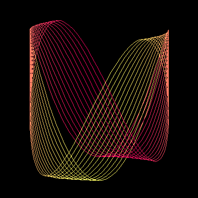

# Oscilloscope


This creates a simple rotating pattern as seen on old style oscilloscope screens.

```logo
To New
 # set default screen, pen and turtle values
 ResetAll SetScreenSize [400 400] HideTurtle
 SetSC Black SetPC Green SetPS 1 PenUp
End
To Spir :A
 Make "T 0 SetPC Black PenDown
 For [S 0 360 8] [SetPos XYCurve :A :S :T
 For [T 0 360 4] [SetPC AngCol :T SetPos XYCurve :A :S :T]
 Refresh Wash] # put a wait in here if too fast
End
To XYCurve :A :S :T
 Make "X 140*(Sin (90+:T))
 Make "Y 140*(Cos ((:A*(:T))+:S))+24*Sin (:T)
 Output List :X :Y
End
To AngCol :T
 Make "Green Round 127*(1+Cos(:T+90))
 Output ( List 255 :Green 100 )
End
To Go
 New Animation
 For [A 2 4] [Spir :A]
End
```
