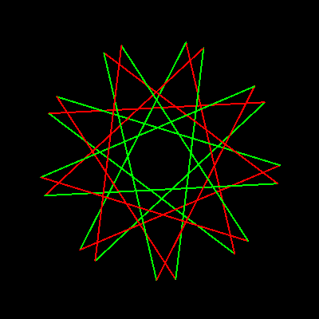

# StarMorph


A random pulsating and rotating star form drawn in overlaid red and green.

```logo
To New
 # set default screen, pen and turtle values
 ResetAll SetScreenSize [400 400] HideTurtle
 SetSC Black SetPC Green SetPS 1 PenUp
End
To Init :Theta
 Make "R 400*Sin (2*:Theta)
 Make "A :R*Sin :Theta
 Make "B :R*Cos :Theta
 Make "X 0 Make "Y 0
End
To StarMorph
 Make "Col1 Absolute (:Col1-3)
 Make "Col2 Absolute (:Col2-3)
 For [Theta 0 90 0.5] [
 Init :Theta
 SetH 0 PenUp Right :Theta
 Repeat 9 [
 Forward :A Left 140
 Forward :B Left 140
 Make "X :X + :X
 Make "Y :Y + :Y]
 SetXY Minus :X/9 Minus :Y/9
 SetH 0 PenDown Right :Theta
 Repeat 9 [
 SetPC :Col1 Forward :A Left 140
 SetPC :Col2 Forward :B Left 140]
 Refresh Wait 2 Wash]
End
To Go
 New Animation SetPW 2
 Make "Col1 1 Make "Col2 2
 Forever [StarMorph]
End
```
