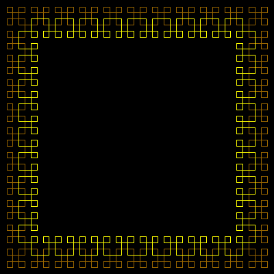

# Border


A small program I found on the web. It was distributed with 'TinyLogo' a Logo emulator for the palm handheld.

```logo
To New
 # set default screen, pen and turtle values
 ResetAll SetScreenSize [400 400] HideTurtle
 SetSC Black SetPC Green SetPS 1 PenUp
End
To Hook :Side
 Repeat 2 [Forward :Side Right 90]
 Forward 3*:Side Right 90
End
To Edge :Side
 Repeat 2 [Hook :Side]
End
To InCorner :Side
 Hook :Side
End
To Join :Side
 Repeat 2 [Forward 3*:Side Right 90]
End
To InSquare :Side :Block
 If :Block<2 
 [Stop]
 Repeat 4 [
 Repeat :Block-2 [
 Edge :Side Join :Side]
 InCorner :Side Join :Side]
End
To OutCorner :Side
 Repeat 3 [Hook :Side]
End
To OutSquare :Side :Block
 If :Block<2 [Stop]
 Repeat 4 [
 Repeat :Block-2 [
 Edge :Side Join :Side ]
 OutCorner :Side Join :Side]
End
To Go :Block
 New Make "Side 380/((4*:Block)-1)
 SetXY -190 190-5*:Side PenDown
 SetPC Brown OutSquare :Side :Block
 PenUp Left 90 Back (4*:Side*:Block)-(6*:Side)
 Right 90 Back 2*:Side PenDown
 SetPC Yellow InSquare :Side :Block-1
End
```
