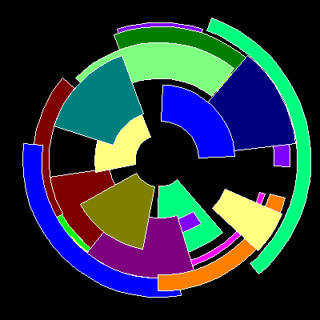

# Eye


A random combination of Clover Leaf and Clover Wave. Each resulting shape 
is placed in a grid with randomly chosen background and fill colors.

```logo
To New
 # set default screen, pen and turtle values
 ResetAll SetScreenSize [400 400] HideTurtle
 SetSC Black SetPC Green SetPS 1 PenUp
End
To Init
 # global values for each sector
 GlobalMake "Angle 10 +Random 110
 GlobalMake "Rad1 10 +Random 170
 GlobalMake "Width 130 -:Angle
 GlobalMake "Rad2 :Rad1 +:Width
 If :Rad2 >180 [Make "Rad2 200 -:Width]
 # Make Hue random color except black or white
 Make "Hue [0 0 0]
 While [Or :Hue=[0 0 0] :Hue=[255 255 255] ] [Make "Hue RandRGB 3]
End
To Sector :Angle :Rad1 :Rad2
 # sector shape drawn from centre (tp)
 Make "Offset (:Rad1+:Rad2) /2 # global offset fill
 Arch :Angle :Rad1
 Arch :Angle :Rad2 Left :Angle/2
 Forward :Rad1 PenDown Forward (:Rad2-:Rad1)
 PenUp Back :Rad2 Right :Angle
 Forward :Rad1 PenDown Forward (:Rad2-:Rad1)
 PenUp Back :Rad2 Left :Angle/2 # return to centre
End
To RandRGB :Ord
 # return random RGB color
 Output (List Val :Ord Val :Ord Val :Ord)
End
To Val :Ord
 # return random value 0-255 in steps of 255/:Ord-1
 Output Int (Random :Ord)*(255/(:Ord-1))
End
To Arch :Angle :Radius
 # symmetrical arc drawn relative to turtle heading
 Arc :Radius Heading-:Angle/2 
 Heading+:Angle/2
End
To Go
 New Repeat 24 [
 Init SetH Random 360 SetPC [9 9 9]
 Sector :Angle :Rad1 :Rad2
 Forward :Offset
 FillZone SetPC :Hue Fill
 Back :Offset
 SetPC White Sector :Angle :Rad1 :Rad2]
End
```
