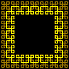
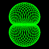
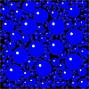
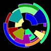
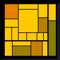
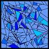

# Art

## [Border](border.md)

## [Cardioid Curves](cardioid.md)

## [Clover Art](cloverart.md)

## [Droplet Condensation](cond.md)

## [Eye](eye.md)

## [Fields](fields.md)

## [Flowers](flowers.md)

## [Ice Cracks](ice.md)

## [Petals](petals.md)

## [Random 
				Shapes](shapes.md)

## [Wire Shapes](wire.md)

