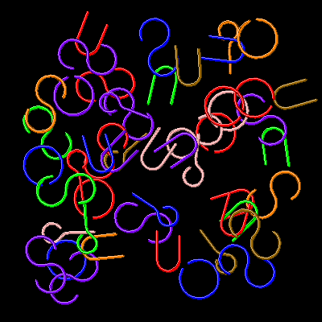

# Wire Shapes


This fills the drawing area with random 
wire shapes. Each shape must finish with the heading unchanged.

```logo
To New
 # set default screen, pen and turtle values
 ResetAll SetScreenSize [400 400] HideTurtle
 SetSC Black SetPC Green SetPS 1 PenUp
End
To Light :Hue
 # output rgb list midway between :hue and white
 Repeat 3 [
 Make "Hue ButFirst LPut Int (255+(First :Hue))/2 :Hue]
 Output :Hue
End
To Dark :Hue
 # output rgb list midway between :hue and black
 Repeat 3 [
 Make "Hue ButFirst LPut Int (First :Hue)/2 :Hue]
 Output :Hue
End
To Arch :Angle :Radius
 # symmetrical arc drawn relative to turtle heading
 Arc :Radius Heading-:Angle/2 
 Heading+:Angle/2
End
To Jump :Side
 # set turtle to random position within square of size side
 SetXY (Random :Side) - :Side/2 (Random :Side) - :Side/2
End
To Wire1 :Parity
 # ring (tp)
 Arch 336 24
End
To Wire2 :Parity
 # right or left hand 'S' shape (tp)
 Repeat 2 [
 Forward 18 Right :Parity*40
 Arch 280 18
 Right :Parity*140 Forward 18]
End
To Wire3 :Parity
 # right or left hand 'U' shape (tp)
 Arch 180 14
 Left :Parity*90 Forward 14 Left :Parity*90
 PenDown Forward 30 PenUp
 Back 30 Left :Parity*90 Forward 28 Right :Parity*90
 PenDown Forward 36 PenUp
 Back 36 Right :Parity*90 Forward 14 Right :Parity*90
End
To Wire4 :Parity
 # right or left hand eyelet (tp)
 Left :Parity*30 Arch 60 12 Right :Parity*30
 Forward 24 Right :Parity*30 Arch 300 12
 Back 22 PenDown Back 30 PenUp
 Forward 52 Left :Parity*30 Back 24
End
To Go
 New SetPC Gray
 Make "myShape 1+Random 4
 Repeat 50 [
 Make "myShape 1+Random 4 
 # comment out for single shape
 Make "Parity Pick [-1 1]
 Jump 300 SetH Random 360
 SetPC Pick [1 2 4 13 14 15 16] 
 # comment out for monotone
 Make "Color PenColor
 SetPW 4 SetPC Dark :Color
 Run Sentence Word "Wire :myShape :Parity
 SetPW 2 SetPC :Color
 Run Sentence Word "Wire :myShape :Parity
 SetX X-1 SetY Y+1
 SetPW 1 SetPC Light :Color
 Run Sentence Word "Wire :myShape :Parity]
End
```
