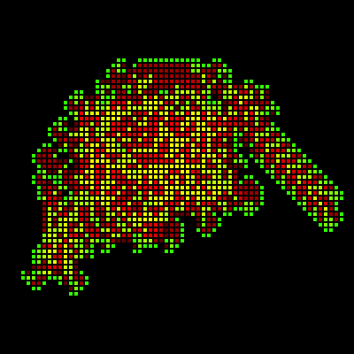

# Langton's Ant


The turtles next step is determined 
by the color of the square it is currently on.  

If black, it inverts the color of the current square, turns left and 
moves one square forward.  

If green, it again inverts the color of the current square, turns 
right and moves one square forward.  

The result is a clump of altered squares, and then after around 10,000 
steps a 'highway' which extends out forever.

```logo
To New
 # set default screen, pen and turtle values
 ResetAll SetScreenSize [400 400] HideTurtle
 SetSC Black SetPC Green SetPS 1 PenUp
End
To NextStep
 Make "Col Item 2 FindColor Pos
 SetPC AngCol PenDown Forward 0 PenUp
 If :Col = 0 [Left 90 Forward 6 Stop]
 If :Col = 255 [Right 90 Forward 6]
End
To AngCol
 Make "Num Item 1 FindColor Pos
 Make "Red :Num + 0.2 * (255-:Num)
 Make "Green 255 - Item 2 FindColor Pos
 Output (List :Red :Green 0)
End
To Go
 New SetPS 0 SetPW 4
 Repeat 10700 [NextStep]
End
```

This uses a slightly different method to produce a mono color version of Langton's Ant.

```logo
To New
 # set default screen, pen and turtle values
 ResetAll SetScreenSize [400 400] HideTurtle
 SetSC Black SetPC Green SetPS 1 PenUp
End
To NextStep
 Left Integer 0.707*(Item 2 FindColor Pos) + 90
 Forward 0 PenUp Forward 6 PenDown
End
To Go
 New SetPS 0 SetPW 4 PX
 Repeat 10700 [NextStep]
End
```
