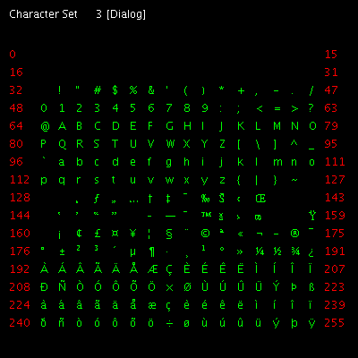

# Characters


This shows the character set of any installed font. Each page contains 255 characters. Fonts can contain upto 65536 characters or 255 pages. Most are much shorter.

```logo
To New
 # set default screen, pen and turtle values
 ResetAll SetScreenSize [400 400] HideTurtle
 SetSC Black SetPC Green SetPS 1 PenUp
End
To Gridd :M :N
 # return X Y screen position
 Make "X (:N*:CellSize) - 155
 Make "Y (:M*:CellSize) - 165
 Output List :X :Y
End
To DrawGrid :Page
 # draw M x N array of squares
 For [M 15 0 -1] [
 For [N 0 15] [
 SetPos Gridd :M :N
 Label Char ((((:Page*255)-15)-(16*:M)) + :N) Wait 1 ] ]
End
To Display
 # write header title and font name
 SetPC White
 Make "myFontName FontName SetFontName 1
 SetPos [-190 180] Label (Se "Character "Set " " " " :myFontName)
End
To Drawaxis :Page
 SetPC Red
 For [C 0 15] [
 Make "YY :C*:CellSize-165
 SetXY Minus 190 :YY Label ((:Page*255)-15)-:C*16
 SetXY 162 :YY Label (:Page*255)-:C*16]
End
To Go :FontNumber :Page
 New
 SetFontName :FontNumber Display
 Make "CellSize 20 DrawAxis :Page
 SetPC Green SetFontName :FontNumber Drawgrid :Page
End
```

Where 2 is the font number and 1 is the first page number. So **Go 4 4** will 
display the fourth page in american typewriter font (on my machine).
