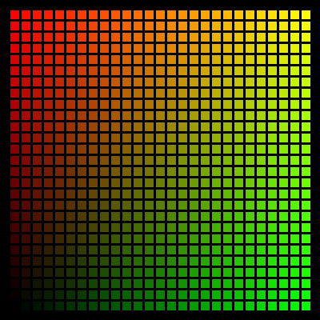

# Colors


This program draws a set of swatches using procedures 'Light' and 'Dark' 
to modify the XLogo colors; (Black Red Green Yellow Blue Magenta Cyan 
White Gray Orange Purple Aqua Leaf Lime and Rose).

Brown is Dark Orange and Pink is Light Magenta.

'Light Light' colors and 'Dark Dark' colors make good background and 
pen color with high contrast. eg. SetSC Dark Dark Blue.

```logo
To New
 # set default screen, pen and turtle values
 ResetAll SetScreenSize [400 400] HideTurtle
 SetSC Black SetPC Green SetPS 1 PenUp
End
To Init
 Make "ColList [Red Green Yellow Blue Magenta Cyan
 Gray Orange Purple Aqua Leaf Lime Rose]
 Make "Mods [ [Dark Dark] Dark [] Light [Light Light] ]
End
To Swatch :Col
 Right 90 PenDown Forward 32 PenUp
 Back 32 Left 90 Forward 27
End
To Display
 # write header title and color names
 SetPC White
 Repeat 13 [
 SetXY 140 27*RepCount -208
 Label Item RepCount :ColList]
 SetPos [-166 176]
 Label [Dark Dark \ \ \ Dark \ \ \ Color \ \ \ Light \ \ \ Light Light]
End
To Light :Hue
 # output rgb list midway between :hue and white
 Repeat 3 [
 Make "Hue ButFirst LPut Int (255+(First :Hue))/2 :Hue]
 Output :Hue
End
To Dark :Hue
 # output rgb list midway between :hue and black
 Repeat 3 [
 Make "Hue ButFirst LPut Int (First :Hue)/2 :Hue]
 Output :Hue
End
To Aqua
 Output [0 128 255] # return aqua rgb color
End
To Leaf
 Output [0 255 128] # return leaf rgb color
End
To Lime
 Output [128 255 0] # return lime rgb color
End
To Rose
 Output [255 0 128] # return rose rgb color
End
To Go
 New SetPS 0 SetPW 18 Init Display
 Repeat 5 [
 Make "Mod Item RepCount :Mods
 SetPos List ((64*RepCount) -238) Minus 175
 Repeat 13 [
 Make "PColor Sentence :Mod Item RepCount :ColList
 SetPC Run Sentence :PColor []
 Write :PColor Print List "\ = PenColor
 Swatch :PColor]
 Print [] ] # blank line
End
```
