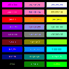
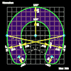

# Coding

## [Characters](char.md)

## [Chequer Grid](chequer.md)

## [Colors](colors.md)

- [Random Dots](dots.md)
## [R G B](rgb.md)

## [R G B](rgbs.md)

## [Shapes](shapes.md)

- [Tracker](tracker.md)
- [X-Hair](xhair.md)
