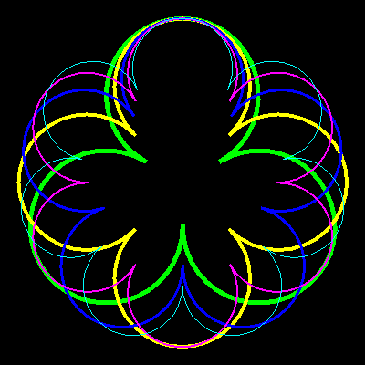

# Clover Leaf / Wave


This program draws a clover with any number of leaves or waves. It requires 
a bit of trigonometry to find the distance :Dist of each arch from the 
centre, and also the angle of each arch.

```logo
To New
 # set default screen, pen and turtle values
 ResetAll SetScreenSize [400 400] HideTurtle
 SetSC Black SetPC Green SetPS 1 PenUp
End
To Clover_Leaf :N :Size
 # draw clover leaf with N leaves of total diameter Size
 Make "Dist (:Size/2)/(1+Sin (180/:N))
 Repeat :N [
 Forward :Dist Arch 180*(1+2/:N) (:Size/2)-:Dist
 Back :Dist Left 
 360/:N]
End
To Clover_Wave :N :Size
 # draw clover wave with N waves of total diameter Size
 Make "Dist (:Size/2)/(1+Sin (90/:N))
 Repeat :N [
 Forward :Dist Arch 180*(1+1/:N) (:Size/2)-:Dist
 Back :Dist Left 180/:N
 Forward :Dist Left 180 Arch 180*(1-1/:N) (:Size/2)-:Dist Left 180
 Back :Dist Left 180/:N]
End
To Arch :Angle :Radius
 # symmetrical arc drawn relative to turtle heading
 Arc :Radius Heading-:Angle/2 
 Heading+:Angle/2
End
To Go :N
 New Clover_Leaf :N 360 # or change to Clover_Wave
End
To GoX
 New Animation
 For [N 3 10] [Wash
 Clover_Leaf :N 360 # or change to Clover_Wave
 Refresh Wait 60]
End
```

Type in **Go :N** for individual shapes.  

Change Clover_Leaf to Clover_Wave to draw a gear shape. Add penwidth and 
pencolor to GoX for more complex drawings.

For more random clover shapes see:

[Clover Art](../art/cloverart.md)
