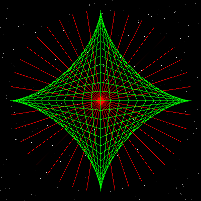

# Demo Star


This program has 6 procedures: New, Dust, RanPoint, Star, 
Net and Go.
To run the program:

1. Hi-light **all** the code in the yellow box (click 
and drag).
2. **Copy** the code (Edit Copy).
3. Switch to **XLogo** and open the **Editor** window.
4. **Paste** in the code (Edit Paste).
5. Press the **Penguin** button to save the code and close 
the Editor.
6. Type in '**go**' and press <Enter> to run the 
program.

```logo
To New
 # set default screen, pen and turtle values
 ResetAll SetScreenSize [400 400] HideTurtle
 SetSC Black SetPC Green SetPS 1 PenUp
End
To Dust
 Repeat 256 [Jump 390 Dot Pos]
End
To Jump :Side
 # set turtle to random position within square of size side
 SetXY (Random :Side) - :Side/2 (Random :Side) - :Side/2
End
To Burst :Spokes :Radius
 # star burst drawn from centre (tp)
 Repeat :Spokes [
 PenDown Forward :Radius
 PenUp Back :Radius
 Right 360/:Spokes Wait 2]
End
To Net
 For [Angle 0 360 6] [
 PenUp SetXY 180*Cos :Angle 0
 PenDown SetXY 0 180*Sin :Angle Wait 4]
End
To Go
 New SetPC White Dust
 Home SetPC Red Burst 40 180
 SetPC Green Net
End
```

XLogo should create the graphic as shown on the right.  

To clear the graphics window and reset the turtle, type in **'new'**.  

Check out the code comments and explanation below.

```logo
'New' resets 
 all XLogo parameters, sets the screen to size 400x400 black, 
 hides the turtle, raises the pen and sets its color to green.
'Dust' goes 
 to a random point and draws a single pixel, 256 times. A single 
 pixel is drawn by lowering the pen, moving forward 0 pixels 
 and then raising the pen again.
'Jump' 
 picks a random point within the graphics window. Both x and 
 y axis range from -200 to +200 pixels.
'Burst' starts 
 from the centre of the screen, and, 40 times, it 
 draws a line 180 pixels long, returns to the screen centre and 
 turns 9 degrees left.
'Net' uses 
 sine and cosine maths to draw a series of 60 lines. A 'For' 
 loop steps from 0 to 360 every 6 degrees.
'Go' defines 
 the various pen colors and calls each procedure in order to 
 draw the complete graphic.
```

You can try the other defined procedures by typing in thier names 
individually. eg **'dust'**, **'star'** or **'net'**. Logo 
is not case sensitive, so **star** is the same as **Star**. 
You can alter the drawing speed by changing the delay time in procedure **new**.
