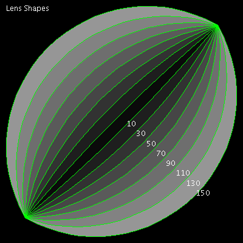

# Lens


This program draws lens shapes of different angles. It requires a bit 
of trigonometry to find the distance :Dist of each arch from the centre 
of the lens.

```logo
To New
 # set default screen, pen and turtle values
 ResetAll SetScreenSize [400 400] HideTurtle
 SetSC Black SetPC Green SetPS 1 PenUp
End
To Lens :Angle :Size
 # lens shape drawn from centre (tp)
 Make "Dist (:Size/2)/Tan :Angle/2
 Repeat 2 [
 Back :Dist Arch :Angle (:Size/2) / Sin :Angle/2
 Forward :Dist Left 180]
End
To Arch :Angle :Radius
 # symmetrical arc drawn relative to turtle heading
 Arc :Radius Heading-:Angle/2 
 Heading+:Angle/2
End
To Go
 New
 For [Ang 150 10 -20] [ # 230 10 -20
 Home Left 45
 SetPC Green Lens :Ang 448 # 256
 SetPC (List :Ang :Ang :Ang) Fill
 Back 1.15 *:Ang Right 45
 SetPC White Label :Ang Wait 30]
 SetPos [-190 182] Label [Lens Shapes]
End
```

Type in **Lens :Angle :Size** for individual lens shapes.

Also see: [Lune Trees](../tree/lune.md)
