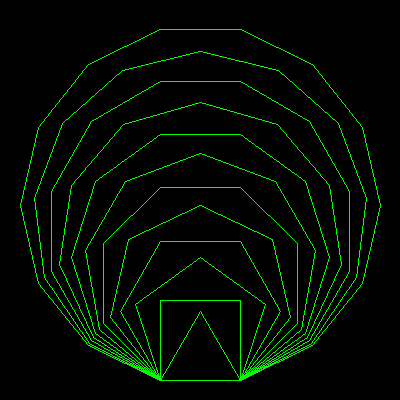

# Polygons


This program draws a series of nested polygons. It has 2 procedures: New and Go. To run the program:

1. Hi-light **all** the code in the yellow box (click and drag).
2. **Copy** the code (Edit Copy).
3. Switch to **XLogo** and open the **Editor** window.
4. **Paste** in the code (Edit Paste).
5. Press the **Penguin** button to save the code and close the Editor.
6. Type in '**go**' and press <Enter> to run the program.

```logo
To New
 # set default screen, pen and turtle values
 ResetAll SetScreenSize [400 400] HideTurtle
 SetSC Black SetPC Green SetPS 1 PenUp
End
To Go
 New Back 180 Right 90 Back 40 PenDown
 For [N 3 14] [
 Repeat :N [Forward 80 Left 360/:N] Wait 30]
End
```

XLogo should create the graphic as shown on the right.  

To clear the graphics window and reset the turtle, type in '**new**'.  

Check out the code comments and explanation below.

**Polygon Names:** Triangle, Square, Pentagon, Hexagon, 
Heptagon, Octagon, Nonagon, Decagon, Undecagon, and Dodecagon. Sides of 
13 and 14 have no name.

'New' resets all XLogo parameters,  sets the screen to size 400x400 black, hides the turtle, raises the 
pen and sets its color to green.

'Go' calls the New procedure and moves the turtle to the lower left facing right. It then draws twelve 
N-sided polygons for values of N from 3 to 14.

This code will draw a polygon from the centre, which can be more useful 
when building programs. As N gets larger, the polygon tends to a circle.  

The polygon procedure is a library item. See [Shapes](../../ipt/info/proshape.md) for more ideas and library procedures.

```logo
To New
 # set default screen, pen and turtle values
 ResetAll SetScreenSize [400 400] HideTurtle
 SetSC Black SetPC Green SetPS 1 PenUp
End
To Polygon :N :Wide
 # polygon of 'N' sides drawn from centre (tp)
 Make "Side :Wide *Sin 180/:N # length of one side
 Right 180/:N Back :Wide/2 Right 90-180/:N PenDown
 Repeat :N
 [Forward :Side Left 360/:N]
 PenUp Left 90-180/:N Forward :Wide/2 Left 180/:N # return to centre
End
To Go
 New For [N 3 9] [
 Polygon :N 384 Wait 30]
End
```
