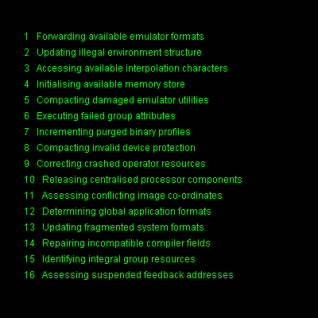

# Please Wait...


An example of creating a sentence from 
words randomly picked from a list.

```logo
To New
 # set default screen, pen and turtle values
 ResetAll SetScreenSize [400 400] HideTurtle
 SetSC Black SetPC Green SetPS 1 PenUp
End
To Init
 Make "Word1 Pick [ 
 Accessing Allocating Assessing Calculating Clearing Compacting 
 Comparing Configuring Confirming Correcting Deleting Detecting 
 Determining Downloading Eliminating Enabling Executing Expanding 
 Forwarding Generating Identifying Incrementing Initialising 
 Interpreting Not_Found Preparing Processing Reading Releasing 
 Repairing Retrieving Searching_For Terminating Transferring 
 Tracking Updating Writing ]
 Make "Word2 Pick 
 [ anticipated asynchronous available bad centralised conflicting 
 corrupt crashed critical damaged default failed fragmented global 
 illegal incompatible incorrect independent integral invalid 
 missing modified multi obsolete out-of-range primary priority 
 purged redundant reserved split suspended tempory terminated 
 unstable unsupported ]
 Make "Word3 Pick 
 [ application binary buffer bus cache compiler control data-base 
 destination device display directory emulator environment feedback 
 group image interpolation interrupt management media memory 
 menu network operator processor program self-test session software 
 system target timing user ]
 Make "Word4 Pick 
 [ activity addresses attributes characters codes commands components 
 contents continuity counters co-ordinates elements errors fields 
 files formats functions information levels modes options over-run 
 procedures profiles protection requests resources routines sectors 
 store structure support threads utilities values variables ]
End
To Go
 New SetPos [-180 150]
 Repeat 16 [ Init
 Label ( List Repcount :Word1 :Word2 :Word3 :Word4 )
 Back 20 Wait 88]
End
```

Haiku poetry.

Three lines which rarely rhyme. Usually of nature and seasons.

```logo
To New
 # set default screen, pen and turtle values
 ResetAll SetScreenSize [400 400] HideTurtle
 SetSC Black SetPC Green SetPS 1 PenUp
End
To Init
 Make "AdjList [calm cool tiny new fresh early first light soft sudden]
 Make "NounList [showers dawn dew moon evening stars mist blossoms sun leaves snow breeze buds flowers trees]
 Make "VerbList [fall open close greet serenade blow pile swim float catch hold fade]
 Make "Adj :AdjList
 Make "Noun :NounList
 Make "Verb :VerbList
End
To PickNoun
 Make "Selection Pick :Noun
 Make "Noun Remove :Selection :Noun
 Output :Selection
End
To PickAdj
 Make "Selection Pick :Adj
 Make "Adj Remove :Selection :Adj
 Output :Selection
End
To PickVerb
 Make "Selection Pick :Verb
 Make "Verb Remove :Selection :Verb
 Output :Selection
End
To Go
 New Init SetFontSize 22
 SetPos [-180 102]
 Label (List PickAdj PickAdj PickNoun PickVerb) Wait 30
 SetPos [-180 70]
 Label (List Pick [in with of so through on] 
 PickAdj PickNoun PickVerb "and) Wait 30
 SetPos [-180 38]
 Label (List PickVerb "the PickAdj PickAdj PickNoun)
End
```
