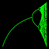
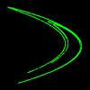
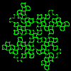
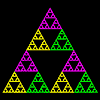

# Dotplot

## [Bifurcation Diagram](bifur.md)

## [Dust Collecting](dust.md)

## [Fractal Fern](fern.md)

## [GingerBread Man](gbman.md)

## [Hénon Curves](henon.md)

## [HopAlong](hop.md)

## [Kam Torus](kam.md)

## [Mandelbrot Set](mand.md)

## [Martin 'Curve'](martin.md)

## [Pi Island](pie.md)

## [Popcorn](popcorn.md)

## [Sierpinski Triangle](sier.md)

