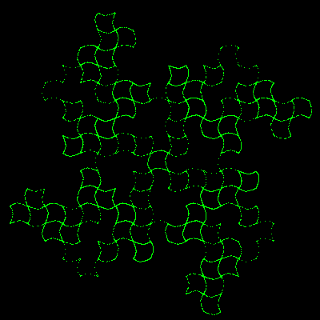

# Martin 'Curve'


This draws a quilt of squares. 
Increase the number of iterations, and reduce the scale to see more 
squares.

```logo
To New
 # set default screen, pen and turtle values
 ResetAll SetScreenSize [400 400] HideTurtle
 SetSC Black SetPC Green SetPS 1 PenUp
End
To Martin
 Repeat :Iters [
 Make "Xnew :Y - Sin (:X*180/pi)
 Make "Y :Angle - :X
 Make "X :Xnew
 Dot List (:X*:Scale)-:Offset (:Y*:Scale)-:Offset]
End
To Go
 New
 Make "X 0 Make "Y 0
 Make "Angle 3.14 # try 3.1415 or 3.141593
 # Make "Scale 12 Make "Iters 8000
 Make "Scale 7 Make "Iters 20000
 Make "Offset 1.8 * :Scale
 Martin
End
```
