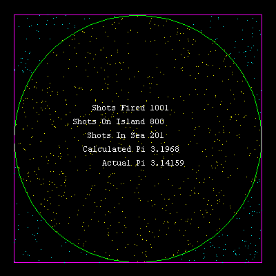

# Pi Island


The value of pi can be estimated 
by firing shells at a circular island in a square lagoon. If the shells 
fall randomly, then the value of pi is the ratio of shells that fall 
on land (times four), to the total number of shots fired.

```logo
To New
 # set default screen, pen and turtle values
 ResetAll SetScreenSize [400 400] HideTurtle
 SetSC Black SetPC Green SetPS 1 PenUp
End
To Pie :Shots
 Make "ShotsFired 0 DrawLand DrawSea
 Repeat :Shots [
 Fire SetPC White Display Refresh SetPC Black Display]
 SetPC White Display
End
To DrawLand
 Make "LandShots 0
 SetPC Green Home Circle 180
End
To DrawSea
 Make "SeaShots 0
 SetPC Magenta SetPos [-180 -180]
 PenDown Repeat 4 [Forward 360 Right 90] PenUp
End
To Fire
 SetXY (Random 360)-180 (Random 360)-180
 If (Distance [0 0]) < 180
 [SetPC 3 Make "LandShots :LandShots+1]
 If (Distance [0 0]) > 180
 [SetPC 6 Make "SeaShots :SeaShots+1]
 Make "ShotsFired :ShotsFired+1
 PenDown Forward 0 PenUp
End
To Display
 SetPos [-67 40]
 Label Sentence [Shots Fired] :ShotsFired
 SetPos [-80 20]
 Label Sentence [Shots On Land] :LandShots
 SetPos [-74 0]
 Label Sentence [Shots In Sea] :SeaShots
 Setpos [-80 -20]
 Label Sentence [Calculated Pi] (Round (4*:LandShots/:ShotsFired)*100000) / 100000
 Setpos [-52 -40]
 Label Sentence [Actual Pi] 3.14159
End
To Go
 New Animation Pie 101
End
```

Increase the number of shots fired eg **Pie 1001** to improve 
accuracy.
