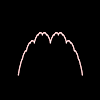
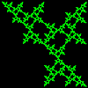
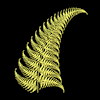

# Fractal

## [Blancmange Curve](blanc.md)

## [Chiral Star](chiral.md)

## [C_Curve](c_curve.md)

## [Fern](fern.md)

## [Gasket](gasket.md)

## [Koch Snowflake Curve](koch.md)

## [More Koch Curves](koch2.md)

## [Lace Curve](lace.md)

