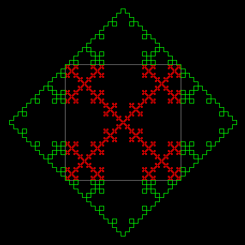

# More Koch Curves


Similar to the Koch Snowflake 
curve, this curve uses a square base.

```logo
To New
 # set default screen, pen and turtle values
 ResetAll SetScreenSize [400 400] HideTurtle
 SetSC Black SetPC Green SetPS 1 PenUp
End
To Init
 PenUp SetPos [-94 -94] PenDown
End
To Koch :Level :Side
 If :Level < 1 [Forward :Side Stop]
 Koch :Level-1 :Side/3 Left 90
 Koch :Level-1 :Side/3 Right 90
 Koch :Level-1 :Side/3 Right 90
 Koch :Level-1 :Side/3 Left 90
 Koch :Level-1 :Side/3
End
To KIn :Level :Side
 SetH 90 Repeat 4 [Koch :Level :Side Left 90]
End
To KOut :Level :Side
 SetH 0 Repeat 4 [Koch :Level :Side Right 90]
End
To Go :LevelIn :LevelOut
 New Init SetPC Gray KIn 0 189
 SetPC Red KIn :LevelIn 189 SetPC Green KOut :LevelOut 189
End
```

Type in **go** and the inside and outside levels eg **go 4 3** to draw square inside and outside Koch curves.

```logo
To New
 # set default screen, pen and turtle values
 ResetAll SetScreenSize [400 400] HideTurtle
 SetSC Black SetPC Green SetPS 1 PenUp
End
To Init
 PenUp SetPos [-160 -100] PenDown
End
To Koch :Level :Side
 If :Level < 1 
 [Forward :Side Stop]
 Koch :Level-1 :Side/4 Left 60
 Koch :Level-1 :Side/4 Right 120
 Koch :Level-1 :Side/4
 Koch :Level-1 :Side/4 Left 120
 Koch :Level-1 :Side/4 Right 60
 Koch :Level-1 :Side/4
End
To KCurve :Level :Side
 SetH 30 Repeat 3 [Koch :Level :Side Right 120]
End
To Go :Level
 New SetPC White Init KCurve :Level 320
End
```


Copy and paste the above procedure into XLogo and type in **go** and the level eg **go 2** to draw a level 2 curve.

```logo
To New
 # set default screen, pen and turtle values
 ResetAll SetScreenSize [400 400] HideTurtle
 SetSC Black SetPC Green SetPS 1 PenUp
End
To Init
 PenUp SetPos [-110 -110] PenDown
End
To Koch :Level :Side
 If :Level < 1 
 [Forward :Side Stop]
 Koch :Level-1 :Side/4 Left 90
 Koch :Level-1 :Side/4 Right 90
 Koch :Level-1 :Side/4 Right 90
 Koch :Level-1 :Side/4
 Koch :Level-1 :Side/4 Left 90
 Koch :Level-1 :Side/4 Left 90
 Koch :Level-1 :Side/4 Right 90
 Koch :Level-1 :Side/4
End
To KCurve :Level :Side
 SetH 0 Repeat 4 [Koch :Level :Side Right 90]
End
To Go :Level
 New SetPC White Init KCurve :Level 220
End
```


Copy and paste the above into XLogo and type in **go** and the **level** eg **go 2** to draw a level 2 curve.
