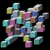
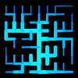
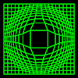
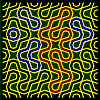

# Grid

## [Cubes](cubes.md)

## [Drain](drain.md)

## [Elastic Grids](elasgrid.md)

## [Grids](gridart.md)

## [Hexagrams](hexagram.md)

## [L.E.D. Display](led.md)

## [Maze](maze.md)

## [Oct Tiles](octtiles.md)

## [3D surfaces](surface.md)

## [Tiles](tile_a.md)

## [Tile](tile_p.md)

