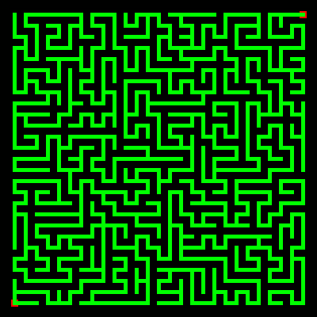

# Maze


This draws a maze of order 27. The turtle wanders randomly until it can go no further. It then picks a random point in the maze and starts drawing again. Eventually, all grid places are occupied and the program stops.

```logo
To New
 # set default screen, pen and turtle values
 ResetAll SetScreenSize [400 400] HideTurtle
 SetSC Black SetPC Green SetPS 1 PenUp
End
To Init
 # global values
 GlobalMake "Order 27
 GlobalMake "Width 378
 GlobalMake "Side :Width/:Order
 GlobalMake "OffSet (:Side/2 - :Width/2)
 GlobalMake "Filled 1
End
To Gridd :M :N
 # return X Y screen position
 Make "X (:N*:Side) + :OffSet
 Make "Y (:M*:Side) + :OffSet
 Output List :X :Y
End
To DrawPath
 # pick a heading and move forward if OK
 While [Not :Headings = [ ] ] [
 SetH Pick :Headings
 If (Item 2 (FindColor TestPos)) = 0 [
 SetPos TestPos
 Make "Headings [0 90 180 270]
 Make "Filled :Filled + 1] [
 Make "Headings Remove Heading :Headings]
 DrawPath]
End
To RandomPlace
 SetPos Gridd Random :Order Random :Order
End
To TestPos
 Output List ((First Pos)+:Side*(Sin Heading)) ((Last Pos)+:Side*(Cos Heading))
End
To Border
 # fill screen edge
 SetPC [0 1 0] SetPW 10 SetXY 196 196 SetH 270
 PenDown Repeat 4 [Forward :Width+15 Left 90] PenUp
End
To Ends
 SetPC Red SetPW :Side/1.5
 Dot Gridd 0 0
 Dot Gridd :Order-1 :Order-1
End
To DrawMaze
 If :Filled = 1 [RandomPlace Dot Pos] [
 While [Not ((Item 2 (FindColor Pos)) = 255) ] [RandomPlace] ]
 Make "Headings [0 90 180 270]
 PenDown DrawPath
 PenUp SetPC [0 254 0] Dot Pos SetPC Green
End
To Go
 New Init Border Ends SetPW :Side/3 SetPC Green
 While [:Filled < Power :Order 2] [DrawMaze]
End
```
