# XLogo Programs

A collection of XLogo programs demonstrating various techniques and concepts.

To run any of these programs:

1. Hi-light **all** the code in the yellow box (click and drag with your mouse).
2. **Copy** the code (select Copy from your browser Edit menu).
3. Switch to **XLogo** and open the **Editor** window (click the Editor button).
4. **Paste** in the code (click the Paste button).
5. Save and close the Editor (click the **disk** button).
6. Type ' **go** ' in the command line and press <Enter>. XLogo will run the program.

## Animations

To create animations, XLogo must first be put into animation mode by the command **Animation** .

Drawing no longer updates the screen but instead changes are stored.

The **Refresh** command updates the graphics screen, as the next 'frame' in the animation. Usually done once per main loop of the program. All the stored changes appear immediately.

A camera icon in the Text Area will remind you animation is on. To return to normal drawing mode, enter **StopAnimation** , or click the camera icon.

| Thumbnail                                                              | Name                                   | Description                                                               |
| ---------------------------------------------------------------------- | -------------------------------------- | ------------------------------------------------------------------------- |
|                     | [LED Display](grid/led.md)             | Scrolling dot matrix text.                                                |
| [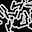](multi/microbes.md)            | [Microbes](multi/microbes.md)          | Animated single cell pond life.                                           |
|                    | [Pi Island](dotplot/pie.md)            | A random calculation of pi.                                               |
| [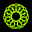](walk/weaver.md)            | [Polygon Weaver](walk/weaver.md)       | Two random polygons are woven together.                                   |
|                  | [TreeAnim](tree/treeanim.md)           | Recursive tree animation, branch angle from 0 to 180 degrees.             |
|                | [Chaos Theory](anim/chaos.md)          | Graphic representation of the chaotic behaviour of a simple equation.     |
|                          | [Cube](anim/cube.md)                   | Tumbling cube corners. Shows the kind of maths needed for 3D programming. |
| [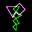](anim/dudeney.md)        | [Dudeney's Disection](anim/dudeney.md) | Old puzzle of an oscillating square to triangle disection.                |
|                | [Linkages](anim/linkages.md)           | Mechanical straight line motion.                                          |
|           | [Oscilloscope](anim/oscilloscope.md)   | Display of rotating sine waves from the days of old oscilloscopes.        |
| [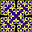](anim/peanocesaro.md) | [Peano Cesaro](anim/peanocesaro.md)    | Variable angle Peano curve.                                               |
|       | [SpiroCircle](anim/spirocircle.md)     | Morphing display of outer circle to different spiro / cycloid patterns.   |
| [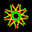](anim/starmorph.md)          | [StarMorph](anim/starmorph.md)         | Evolving red and green star shape, moving and rotating.                   |
|                    | [Tangram](anim/tang.md)                | Tangram pieces sliding between random pictures.                           |

## Art Works

A set of general art programs which, simply, do not fit into any of the other sections.

Some images are generated randomly, and so will produce a different work of art each time.

| Thumbnail                                                        | Name                              | Description                                              |
| ---------------------------------------------------------------- | --------------------------------- | -------------------------------------------------------- |
|             | [Border](art/border.md)           | Double border frame.                                     |
|   | [Cardioid Curve](art/cardioid.md) | Circles of touching radii.                               |
|  | [Clover Art](art/cloverart.md)    | Random clover leaf/wave shapes.                          |
|             | [Condensation](art/cond.md)       | Expanding water droplets.                                |
|                      | [Eye](art/eye.md)                 | Random filled sector shapes.                             |
|                | [Fields](art/fields.md)           | Fields of random stress lines.                           |
|            | [Flowers](art/flowers.md)         | A bunch of flowers demonstrating good use of procedures. |
|                        | [Ice](art/ice.md)                 | Randomly cracked ice sheet.                              |
|                | [Petals](art/petals.md)           | A series of 7 flowers.                                   |
|       | [Shapes Confetti](art/shapes.md)  | Random pile of colored shapes.                           |
| [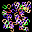](art/wire.md)             | [Wire Shapes](art/wire.md)        | A random collection of wires.                            |

## Cellular Automata

In any cellular automata (CA) program, the screen is divided up into a number of square cells.

The color of each cell represents its state. At the start, all cells are black (state 0).

The turtle starts in one cell. To determine what to do next, the turtle finds the color (state) of its current and neighbouring cells.

This information tells the turtle which cells to recolor (alter the state of) and which neighbouring cell to move to next.

The result is a pattern of different colored cells.

| Thumbnail                                                   | Name                           | Description               |
| ----------------------------------------------------------- | ------------------------------ | ------------------------- |
| [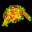](ca/langant.md) | [Langton's Ant](ca/langant.md) | Simple 2D Turing machine. |
|        | [SingleLine CA](ca/caline.md)  | Line by line.             |

## Coding

These programs help in some aspects of coding and the creation of more programs. They are kind of XLogo utilities. Some are also shown in the galleries.

| Thumbnail                                                   | Name                           | Description                                           |
| ----------------------------------------------------------- | ------------------------------ | ----------------------------------------------------- |
|     | [Characters](coding/char.md)   | Draw font characters.                                 |
|  | [Chequer](coding/chequer.md)   | Demo column by row grid.                              |
|          | [Dots](coding/dots.md)         | Fill screen with random dots.                         |
|         | [RGB Colors](coding/rgb.md)    | See the color effects of different AngCol procedures. |
| [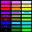](coding/rgbs.md)   | [RGB Swatches](coding/rgbs.md) | Array of RGB color values.                            |
|     | [Shapes](coding/shapes.md)     | Outline shapes with labelled arch and arcs.           |
| [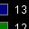](coding/colors.md)    | [Swatches](coding/colors.md)   | XLogo colors 0 to 16.                                 |
| [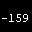](coding/tracker.md)    | [Tracker](coding/tracker.md)   | On screen tracking of any program variable.           |
| [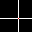](coding/xhair.md)       | [X Hair](coding/xhair.md)      | Add a X-Hair to any XLogo program.                    |

## XLogo Demos

| Thumbnail                                                          | Name                               | Description                                     |
| ------------------------------------------------------------------ | ---------------------------------- | ----------------------------------------------- |
| [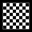](demo/chessboard.md) | [Chessboard](demo/chessboard.md)   | Draw a chessboard.                              |
|    | [Clover Leaf/Wave](demo/clover.md) | Draw a clover leaf or wave shape.               |
|               | [Five Star](demo/star.md)          | Nested series of 5 pointed stars.               |
| [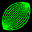](demo/lens.md)                   | [Lens](demo/lens.md)               | Lens shapes.                                    |
|             | [Pebbles](demo/pebble.md)          | Randoml pebble shapes.                          |
| [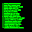](demo/pwait.md)            | [Please Wait](demo/pwait.md)       | Randomly generated computer excuses.            |
| [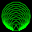](demo/polygon.md)          | [Polygons](demo/polygon.md)        | A set of nested polygons.                       |
| [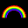](demo/rainbow.md)            | [Rainbow](demo/rainbow.md)         | Six colored arcs.                               |
| [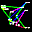](demo/randlines.md)       | [Random Lines](demo/randlines.md)  | A dozen random lines with co-ordinate labels.   |
|           | [Screen Saver](demo/saver1.md)     | A couple of large graphic stars in a night sky. |
|                  | [Star](demo/demostar.md)           | A couple of large graphic stars in a night sky. |
|           | [Star Shapes](demo/stars.md)       | Star outline shape.                             |

## Dot Plots

These images are generated by plotting a (usually large) number of discreet dots. No lines are drawn between dots.

Some of the images are created from mathematical equations, and can take a while to complete.

If a mapping function is used then they are called 'Iterative Function Systems' (IFS).

In XLogo, the dot command plots a single pixel in the pen color at the specified XY co-ordinates. The turtle does not move to the new position to draw the dot.

| Thumbnail                                                            | Name                                    | Description                                       |
| -------------------------------------------------------------------- | --------------------------------------- | ------------------------------------------------- |
|                   | [Dots](coding/dots.md)                  | Fill screen with random dots.                     |
| [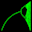](dotplot/bifur.md)   | [Bifurcation Diagram](dotplot/bifur.md) | Plot of f(x)=kx(1-x)                              |
| [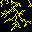](dotplot/dust.md)                    | [Dust](dotplot/dust.md)                 | Floating specks of dust gather together.          |
| [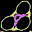](dotplot/hop.md)                | [Hopalong](dotplot/hop.md)              | Random hopalong function plots.                   |
| [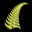](dotplot/fern.md)            | [Fractal Fern](dotplot/fern.md)         | Chaos Game rendition of a fern. (IFS)             |
|       | [Ginger Bread Man](dotplot/gbman.md)    | A linear map in the shape of a gingerbread man.   |
|           | [Hénon Curves](dotplot/henon.md)        | Two dimensional quadratic maps.                   |
| [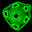](dotplot/kam.md)                 | [Kam Torus](dotplot/kam.md)             | A quick dot plot image.                           |
|               | [Mandelbrot](dotplot/mand.md)           | Classic Mandelbrot image.                         |
| [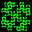](dotplot/martin.md)              | [Martin](dotplot/martin.md)             | A patch work quilt of extended squares.           |
|                  | [Pi Island](dotplot/pie.md)             | A random calculation of pi.                       |
|          | [Popcorn](dotplot/popcorn.md)           | Strange quilted popcorn fractal.                  |
| [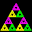](dotplot/sier.md) | [Sierpinski Gasket](dotplot/sier.md)    | Recursive generation of sierpinski gaskets. (IFS) |

## Fractals

Fractal curves are self similar. They are constructed from many similar shapes scaled up (made bigger) or down (smaller).

Moutains, clouds and trees are examples of natural fractals.

| Thumbnail                                                           | Name                                    | Description                            |
| ------------------------------------------------------------------- | --------------------------------------- | -------------------------------------- |
|       | [Blancmange Curve](fractal/blanc.md)    | Blancmange curve.                      |
| [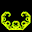](fractal/c_curve.md)          | [C_Curve](fractal/c_curve.md)           | Fractal C_Curves, orders 0-9.          |
|         | [Chiral Star](fractal/chiral.md)        | Recursive star gasket.                 |
| [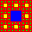](fractal/gasket.md)             | [Gasket](fractal/gasket.md)             | Recursive hole removal.                |
|              | [Koch Curve](fractal/koch.md)           | Both inside and outside Koch curves.   |
|  | [Koch (Square) Curve](fractal/koch2.md) | Inside and outside Koch square curves. |
|            | [Lace Curve](fractal/lace.md)           | Lace plane filling curve.              |

## Grids

These programs are all based on a strong grid structure of vertical and horizontal lines.

A grid is created by using a pair of nested loops. These generate the XY co-ordinates of each cell within the grid.

| Thumbnail                                                      | Name                              | Description                             |
| -------------------------------------------------------------- | --------------------------------- | --------------------------------------- |
|           | [Cubes](grid/cubes.md)            | Cubic art sculpture.                    |
|               | [Drain](grid/drain.md)            | Water drainage systems.                 |
| [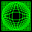](grid/elasgrid.md) | [Elastic Grids](grid/elasgrid.md) | Mathematically distorted grids.         |
|           | [Grid Art](grid/gridart.md)       | A regular array of assembled squares.   |
| [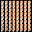](grid/hexagram.md)    | [Hexagrams](grid/hexagram.md)     | Ancient chinese binary fortune telling. |
|             | [LED Display](grid/led.md)        | Scrolling dot matrix text.              |
| [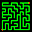](grid/maze.md)               | [Maze](grid/maze.md)              | Self creating random mazes.             |
| [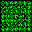](grid/octtiles.md)   | [Oct Tiles](grid/octtiles.md)     | Random pattern edge matching tiles.     |
| [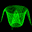](grid/surface.md)      | [Surface](grid/surface.md)        | 3D surface grids.                       |
|    | [Tile Array](grid/tile_a.md)      | Various tile arrays.                    |
|  | [Tile Pattern](grid/tile_p.md)    | Various tile patterns.                  |

## Illusions

These programs create visual optical illusions. Some are famous, others I've just come across by experimenting.

You can of course use XLogo to alter the features of each illusion, and discover even stranger and stronger distortions.

| Thumbnail                                                                | Name                                   | Description                                          |
| ------------------------------------------------------------------------ | -------------------------------------- | ---------------------------------------------------- |
|          | [After Image](illusion/afterim.md)     | Negative color appearance.                           |
|             | [Assimilation](illusion/assim.md)      | Color blending.                                      |
|                    | [Bulge](illusion/bulge.md)             | Bulging grid.                                        |
|          | [Cafe Wall](illusion/cafewall.md)      | Distorted tile pattern.                              |
| [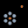](illusion/circle.md)               | [Circles](illusion/circle.md)          | Relative shape sizes.                                |
|         | [Color Names](illusion/colors.md)      | Left right brain confusion.                          |
|        | [Fraser Illusion](illusion/fraser.md)  | Twisted vertical lines.                              |
|                       | [Grid](illusion/grid.md)               | Distorted square grid.                               |
|         | [Hermann Grid](illusion/hermann.md)    | Intersecting dark spots.                             |
|              | [Hexagon](illusion/hexagon.md)         | Distorted figure.                                    |
|     | [Intertwine](illusion/intertwine.md)   | Intertwined concentric circles.                      |
|              | [Kanizsa](illusion/kanizsa.md)         | Illusory floating triangle shape.                    |
|              | [Marbles](illusion/marbles.md)         | Op art distortion.                                   |
|       | [Negative Circles](illusion/n_circ.md) | Floating shapes.                                     |
| [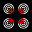](illusion/neon.md)                      | [Neon](illusion/neon.md)               | Square patch of color.                               |
| [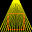](illusion/orb.md)                    | [Orbinson](illusion/orb.md)            | Distorted square.                                    |
|              | [Revolve](illusion/revolve.md)         | Two revolving rings.                                 |
| [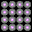](illusion/scintillate.md) | [Scintillate](illusion/scintillate.md) | Scintillating tile pattern.                          |
| [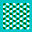](illusion/seaweed.md)             | [Seaweed](illusion/seaweed.md)         | Waving tile pattern illusion.                        |
|           | [Segments](illusion/segments.md)       | Similar segment shapes.                              |
|                       | [Sine](illusion/sine.md)               | Sine wave illusion.                                  |
|                 | [Spiral](illusion/spiral.md)           | Concentric circle spirals.                           |
|                       | [Tube](illusion/tube.md)               | Continuous swaying motion.                           |
|             | [Twisted Cord](illusion/twist.md)      | Vertical cords appear to bend.                       |
|                       | [Wave](illusion/wave.md)               | Continuous wave motion.                              |
|         | [White's Illusion](illusion/white.md)  | Gray rectangles appear different colors behind bars. |
|                 | [ZigZag](illusion/zigzag.md)           | Distorted lines.                                     |
|              | [Zollner](illusion/zollner.md)         | Distorted horizontal lines in tiled grid.            |
|                       | [Zoom](illusion/zoom.md)               | Continuous zoom motion.                              |

## Lindenmayer Systems

L-Systems were invented in 1968 by Aristid Lindenmayer to model biological growth. They provide a flexible method for drawing many curves and fractals.

They start with an axiom list, and then use a set of production rules to modify the elements in this list. This process of string substitutions is then repeated at each iteration. It can create very long lists.

A second procedure then renders the list, by translating each element into a turtle command which draws the final curve.

Also see .

| Thumbnail                                                              | Name                                      | Description                                     |
| ---------------------------------------------------------------------- | ----------------------------------------- | ----------------------------------------------- |
| [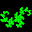](l-system/dragon.md)         | [Dragon Curve](l-system/dragon.md)        | Curve of Dragon like form.                      |
| [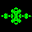](l-system/lsys1.md) | [L-System Single Rule](l-system/lsys1.md) | Seven L-Systems with single F replacement rule. |
|  | [L-System Double Rule](l-system/lsys2.md) | Five L-Systems with single F replacement rule.  |
|                    | [Weeds](l-system/weeds.md)                | Natural forms weeds, leaves and trees.          |

## Multi Turtle

XLogo allows a number of turtles to be on screen at the same time. The maximum number is defined in the options menu.

Use the command **SetTurtle x** to control tutle number x. If the turtle does not already exist, it will be created. Newly created turtles are hidden and start at the home position.

| Thumbnail                                                      | Name                              | Description                                                          |
| -------------------------------------------------------------- | --------------------------------- | -------------------------------------------------------------------- |
|  | [Elastic Grids](grid/elasgrid.md) | A second turtle is used to convert rectangular to polar coordinates. |
|     | [Microbes](multi/microbes.md)     | Animated single cell pond life.                                      |
|             | [Orbits](multi/orbit.md)          | Spirograph type patterns generated by orbiting turtles.              |
|  | [Pursuit Curve](multi/pursuit.md) | Turtle following turtle following turtle...                          |
|    | [Snowflakes](multi/snowflake.md)  | Random ice crystal  patterns.                                        |

## One Liners

Copy and paste any **one** line of code into the XLogo command line and press <Enter> key to run. Widen the XLogo window to easily see and edit a long instruction.

You may need to first type in **CS** to clear the screen. You can change the default pen and screen color by selecting Tools / Preferences / Options from the XLogo menu.

To slow down the drawing speed add in your own **Wait** commands.

Try and work out the image each code will produce before you run it...

## View 3D

These programs use perspective mode to allow the turtle to move in 3D space. This adds a depth Z value to the normal 2D X and Y values.

Building shapes in 3D is not as easy as 2D. The turtle can roll and pitch, so there are often several different ways of drawing a given shape.

A 2D square has 4 edges and 4 corners. In 3D a cube has 6 faces, 8 corners and 12 edges.

Entering **View 3D** displays the lines, points and surfaces in fully rotateable 3D. Lights and fog can be added.

Note: Type in the command CS View3D to clear the View3D window and prevent too many shapes building up.

| Thumbnail                                                         | Name                               | Description                                  |
| ----------------------------------------------------------------- | ---------------------------------- | -------------------------------------------- |
|     | [Cube Octahedron](pers/cubeoct.md) | Wire frame and balls cube octahedon.         |
|                    | [Dice](pers/dice.md)               | Colored dice, correctly labelled.            |
| [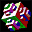](pers/fcube.md)            | [Face Cube](pers/fcube.md)         | Cube face 'parasols' recursion.              |
|         | [Knight's Tour](pers/ktour.md)     | Cube 4x4x4 array knight's tour.              |
|         | [Mobius Band](pers/mobius.md)      | Twisted paper loop.                          |
|  | [Platonic Solid](pers/platonic.md) | All 5 regular platonic solids.               |
| [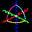](pers/xyz.md)                 | [XYZ Axis](pers/xyz.md)            | Demo of XYZ relative and absolute positions. |

## Plane Filling Curves

Plane filling cuvres are a continueous line through a flat (2D) space.

By using a recursive procedure, the curve becomes ever more detailed. It increases in length and at its limit will visit every point in the space.

Hence, the enclosed 2D space has been filled with a curve of infinite length.

We cannot iterate an infinite number of times. Hence we can only draw an approximate curve by iterating just a few times.

Also see .

| Thumbnail                                                         | Name                                | Description                                         |
| ----------------------------------------------------------------- | ----------------------------------- | --------------------------------------------------- |
|        | [Dragon Curve](plane/dragon.md)     | Folded paper strip Dragon curve, orders 0-11.       |
|           | [Grate Curve](plane/grate.md)       | Recursive plane filling Grate curve.                |
|     | [Hilbert Curve](plane/hilbert.md)   | Recursive Hilbert curves.                           |
| [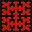](plane/hilbert2.md) | [Hilbert2 Curve](plane/hilbert2.md) | Recursive Hilbert2 curves.                          |
| [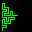](plane/knuth.md)          | [Knuth Curve](plane/knuth.md)       | Recursive plane filling Knuth curve.                |
|          | [Peano Curve](plane/peano.md)       | Recursive plane filling Peano curve.                |
|        | [Peano2 Curve](plane/peano2.md)     | Recursive plane filling second type of Peano curve. |
| [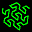](plane/pg.md)       | [Peano Gosper Curve](plane/pg.md)   | Recursive hexagonal plane filling curve.            |
|        | [Sierpinski Curve](plane/sier.md)   | Recursive plane filling Sierpinski curve.           |
|    | [Sierpinski Triangle](plane/stc.md) | Recursive triangular plane filling curve.           |
|           | [Wirth Curve](plane/wirth.md)       | Recursive plane filling Wirth curve.                |

## Polar Curves

All these curves are generated using equations in polar (Radius and Theta) form.

Usually, we plot points using X Y co-ordinates, (or Rectangular notation). A pair of numbers, define the horizontal and vertical distance from the origin. In XLogo, the command **SetXY** moves the turtle to any XY point on the screen.

Alternatively, we can use polar co-ordinates. These again use a pair of numbers. The first (called Radius) gives the distance from the origin. The second (called Theta) gives the angle or bearing (measured from North).

Again, we can move the turtle to any point on the screen. Note that using polar notation, points can be expressed in more than one way. We can turn in a positive or negative direction. Also the Radius can be positive (forward) or negative (back).

Sometimes, they are then converted into X Y co-ordinates for drawing by the turtle using the **SetXY** command by the procedure **P2R** (polar to rectangular). It requires two varibles, Radius and Theta and outputs the X and Y co-ordinates as a list.

| Thumbnail                                                               | Name                                      | Description                                       |
| ----------------------------------------------------------------------- | ----------------------------------------- | ------------------------------------------------- |
|               | [Butterfly Curve](polar/bfly.md)          | The butterfly curve.                              |
|                       | [Flora](polar/flora.md)                   | Scattering of colored flower petals.              |
|             | [Rose Curves](polar/polarrose.md)         | Various rose curves.                              |
|           | [Spirals](polar/polarspirals.md)          | Archimedies, Fermat and logarithmic spirals.      |
|           | [Sunflower](polar/sunflower.md)           | Entwined logarithmic spirals of a sunflower head. |
|     | [Twisted Rose Curve](polar/polartwist.md) | Various twisted rose curves.                      |
|  | [Twisted R C Anim](polar/rosecurves.md)   | A series of 20 twisted curves.                    |

## Puzzles

A selection of puzzles and simple games. Some are self solving, others require user input from the mouse or keyboard.

ReadChar and ReadMouse primitives are used to read keyboard key presses and mouse movement.

| Thumbnail                                                                | Name                                    | Description                               |
| ------------------------------------------------------------------------ | --------------------------------------- | ----------------------------------------- |
|                         | [15 Puzzle](puzzle/15.md)               | Sam Lloyds classsic sliding block puzzle. |
|             | [Knight's Tour](puzzle/ktour.md)        | Classic knights tour of a chessboard.     |
|  | [Partridge Puzzle](puzzle/partridge.md) | Multiple square disection.                |
|                       | [Rings](puzzle/rings.md)                | Interlocking rotating rings puzzle.       |

## Recursion

Recursion occours when a procedure calls itself. This leads to some efficient programming techniques.

To prevent an infinite loop, the first line is usually a breakout test. If a variable eg size or line length is too small, the command **stop** breaks out of the procedure.

| Thumbnail                                                                  | Name                                      | Description                                         |
| -------------------------------------------------------------------------- | ----------------------------------------- | --------------------------------------------------- |
| [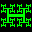](recur/anttree.md)              | [Antenna Tree](recur/anttree.md)          | Antenna Tree curve.                                 |
| [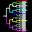](recur/switch.md)               | [Binary Switch](recur/switch.md)          | A divide by two selector switch.                    |
|                  | [Circles](recur/circles.md)               | Recursive circles.                                  |
|                          | [Cross](recur/cross.md)                   | A series of recursive crosses.                      |
|                           | [Edge](recur/edge.md)                     | A recursive edge of tiles.                          |
| [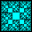](recur/goldsqrs.md)                | [GoldSqrs](recur/goldsqrs.md)             | Recursive Fibbonacci sized squares fractal.         |
|                 | [Hexagons](recur/hexagons.md)             | A series of recursive hexagons.                     |
|                           | [Mesh](recur/mesh.md)                     | Regular lattice.                                    |
| [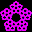](recur/pentagons.md)              | [Pentagons](recur/pentagons.md)           | Series of recursive pentagons.                      |
|                     | [Sphinx](recur/sphinx.md)                 | Repeating sphinx shape.                             |
|  | [Spinning Squares](recur/spinningsqrs.md) | A series of recursive squares one inside the other. |
| [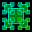](recur/squares.md)            | [Squares Center](recur/squares.md)        | A series of recursive centered squares.             |
| [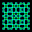](recur/squaresv.md)          | [Squares Corner](recur/squaresv.md)       | A series of recursive corner squares.               |
|                  | [YinYang](recur/yinyang.md)               | YinYang symbol.                                     |

## Sound

A selection of programs that use the sound primitives to create audio.

## Spirals

The following programs exhibit spiral forms. Spirals are common structures in mathematics and nature.

Also see:

| Thumbnail                                                                | Name                                      | Description                                            |
| ------------------------------------------------------------------------ | ----------------------------------------- | ------------------------------------------------------ |
|            | [Pursuit Curve](multi/pursuit.md)         | Turtle following turtle.                               |
|            | [Spirals](polar/polarspirals.md)          | Archimedies, Fermat and logarithmic spirals.           |
|            | [Sunflower](polar/sunflower.md)           | Entwined logarithmic spirals of a sunflower head.      |
| [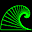](spiral/arcwave.md)             | [Arc Wave](spiral/arcwave.md)             | Series of decreasing sectors.                          |
|        | [Cycloid Curves](spiral/cycloid.md)       | A series of various Cycloid curves.                    |
|       | [Golden Spiral](spiral/goldenspiral.md)   | A rectangle divided into a series of smaller squares.  |
|        | [Plastic Number](spiral/plastic.md)       | A logarithmic spiral of increasing triangles.          |
|                    | [Rose](spiral/spiralrose.md)              | Eight logo spirals.                                    |
|  | [Spiral of Squares](spiral/spiralsqrs.md) | A series of descending squares.                        |
|         | [Spiral Lines](spiral/spirallines.md)     | A variety of spiral forms from recursive line lengths. |
|   | [Spirals (Curvature)](spiral/spirals.md)  | Archimedies and logarithmic spirals.                   |
|               | [Ulam Spiral](spiral/ulamsp.md)           | Prime number spiral pattern.                           |

## Spirographs

These programs follow the techniques of the old spirograph toy, without the leaky pens.

Essentially, a rotating wheel orbits a fixed circle. The resulting curve can be defined in terms of sines and cosines (trigonometry).

| Thumbnail                                                           | Name                                 | Description                                          |
| ------------------------------------------------------------------- | ------------------------------------ | ---------------------------------------------------- |
|         | [Ferris Wheels](spiro/ferris.md)     | Random three term spirograph patterns.               |
|              | [Harmonograph](spiro/harm.md)        | Random multi-colored harmonograph patterns.          |
|           | [Mystic Rose](spiro/spiromr.md)      | Linking evenly spaced points on a circle.            |
|                   | [Spiro](spiro/spiro.md)              | Random generation of second order Spirograph curves. |
|  | [SpiroExplorer](spiro/spiroexplo.md) | Experiment and test out spirograph parameters.       |
|       | [Spirographs](spiro/spirog.md)       | Traditional Spirograph patterns.                     |
|      | [SpiroLaterals](spiro/laterals.md)   | Traditional repeating move and turn patterns.        |
|                  | [String](spiro/string.md)            | String pictures.                                     |

## Trees

These trees are grown using recursive techniques. Each branch splits into two smaller branches, until the branch length is too small to continue.

By varying the branch lengths and angles, more natural looking trees are made.

| Thumbnail                                                         | Name                               | Description                                                   |
| ----------------------------------------------------------------- | ---------------------------------- | ------------------------------------------------------------- |
|      | [Antenna Tree](recur/anttree.md)   | Antenna Tree curve.                                           |
|       | [Binary Switch](recur/switch.md)   | A divide by two selector switch.                              |
|             | [TreeAnim](tree/treeanim.md)       | Recursive tree animation, branch angle from 0 to 180 degrees. |
|      | [Kite Tree](tree/kitetree.md)      | Tree using kite shape branches.                               |
|              | [Tree Basic](tree/tree1.md)        | Simple recursive trees.                                       |
|          | [Tree Leaning](tree/leaning.md)    | Lop-sided leaning tree.                                       |
|          | [Trees Random](tree/tree2.md)      | More natural tree growth.                                     |
|          | [Tree Generator](tree/tree3.md)    | Succession of randomly grown trees.                           |
|  | [Triangular Tree](tree/tritree.md) | Right angled triangle tree.                                   |

## Turtle Walks

These programs allow the turtle to roam or wander across the drawing screen.

Sometimes freely with a random walk. Other times, following a simple mathematical procedure, which can create surprisingly complex images.

| Thumbnail                                                          | Name                                   | Description                                        |
| ------------------------------------------------------------------ | -------------------------------------- | -------------------------------------------------- |
|          | [Arc Step](walk/arcstep.md)            | Random path created from series of 90 degree arcs. |
|  | [Friendship](walk/friendship.md)       | Path created from friendship number series.        |
|         | [Polygon Weaver](walk/weaver.md)       | Two random polygons are woven together.            |
|       | [Ring Wave](walk/ringwave.md)          | Standing sine wave on a circular ring.             |
|     | [Tangle Curves](walk/wandtangle.md)    | Random neurotic knotted curves, optimised.         |
|                 | [Tango](walk/tango.md)                 | Random self circling red and green curves.         |
|           | [Wanderer](walk/wandhappy.md)          | Complex spikey trails from simple initial values.  |
|    | [Wanderer Opt](walk/wandhappyopt.md)   | Optimised to scale patterns to screen.             |
|  | [Wandering Trails](walk/wandtrails.md) | Randomly roaming turtle.                           |

