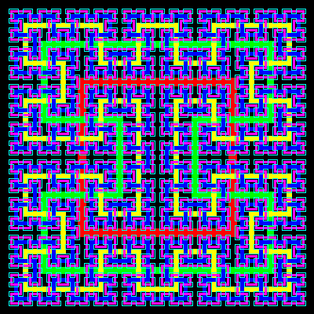

# Hilbert2 Curve


A slight variation on the Hilbert curve, this produces a closed curve with an inside and an outside. It starts with a loop and has six replacement rules. The use of a parity variable reduces this to three procedures.

```logo
To New
 # set default screen, pen and turtle values
 ResetAll SetScreenSize [400 400] HideTurtle
 SetSC Black SetPC Green SetPS 1 PenUp
End
To Init :Level
 GlobalMake "Size 96/(Power 2 :Level) # global value
 GlobalMake "Step Pi * :Size / 10 # global value for curved corners
 PenUp SetXY Minus :Size 0 PenDown
End
To C1 :Level :Parity
 If :Level < 1 [Turn :Parity Stop]
 C2 :Level-1 Minus :Parity
 C2 :Level-1 :Parity
 C1 :Level-1 :Parity
 Str :Level-1 Minus :Parity
End
To C2 :Level :Parity
 If :Level < 1 [Turn :Parity Stop]
 Str :Level-1 Minus :Parity
 C2 :Level-1 :Parity
 C1 :Level-1 :Parity
 C1 :Level-1 Minus :Parity
End
To Str :Level :Parity
 If :Level < 1 [Forward 2*:Size Stop]
 C2 :Level-1 Minus :Parity
 C2 :Level-1 :Parity
 C1 :Level-1 :Parity
 C1 :Level-1 Minus :Parity
End
To Turn :Parity
 Forward :Size Right :Parity*90 Forward :Size
End
To Go :Level
 New Init :Level
 Repeat 2 [C1 :Level 1 C2 :Level 1]
 PenUp Home SetPC DarkRed Wait 30 Fill
End
```

Enter **go** and the **level** eg **go 2** to draw a second 
order Hilbert2 curve.  

Enter **go 0** for the basic path, up to **go 4** or **go 
5** for increasingly complex paths.

Add the following procedure **GoX** to overlay Hilbert2 curves 
from level 1 to 5.

```logo
To GoX
 New For [Level 0 5] [
 #Wash Init :Level SetPC Green
 Init :Level SetPC :Level+1 SetPW 6-:Level # comment out
 Repeat 2 [C1 :Level 1 C2 :Level 1]
 Wait 90]
End
```


Comment in both comment lines for a series of filled Hilbert2 curves.  

Use this curved turn procedure to produce rounded corners.

```logo
To Turn :Parity
 Right :Parity*9
 Repeat 5 [Forward :Step Right :Parity*18]
 Left :Parity*9
End
```
