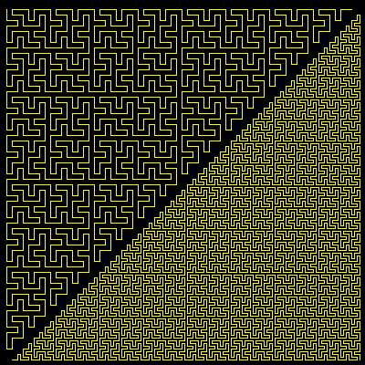

# Knuth Curve


The Knuth curve fills a triangle shape. 
Even and odd orders create left and right handed triangles.

```logo
To New
 # set default screen, pen and turtle values
 ResetAll SetScreenSize [400 400] HideTurtle
 SetSC Black SetPC Green SetPS 1 PenUp
End
To Init :Order
 Make "Pause Absolute 11-:Order
 Make "Ord Round :Order/2
 Make "Size 3 * Power 2 (6-:Ord) # make Size a global value
End
To Knuth :Order :Angle :Turn
 If :Order < 1 [
 Right 45+:Turn Forward :Size Left 45+:Turn Wait :Pause Stop]
 Right 2*:Turn+:Angle
 Knuth :Order-1 2*:Turn Minus :Turn
 Right 45-3*:Turn-:Angle Forward :Size Left 45-:Turn+:Angle
 Knuth :Order-1 0 Minus :Turn
 Right :Angle
End
To Go :Order
 New Init :Order
 SetPos List Minus 190 Minus 184
 SetPC Yellow PenDown
 Knuth :Order Minus 90 45 # angle -90 turn 45
End
```

Type **Go order** for example **Go 7** to run.

For an overlay of Wirth Curves of orders 2-10.

```logo
To GoX
 New
 Make "Cols [3 1 2 4 9]
 For [Order 2 10 2] [ # make [Order 1 10 2] for odd curves
 Init :Order
 SetPW 11-:Order SetPC Item Round :Order/2 :Cols
 PenUp SetPos List Minus 190 Minus 184 PenDown
 Knuth :Order Minus 90 45]
End
```
