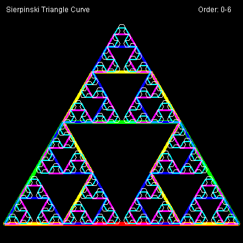

# Sierpinski Triangle Curve


The Sierpinski triangle curve fills 
a triangular shape. It appears similar to the [Sierpinski Triangle](sier.md) dot plot.

```logo
To New
 # set default screen, pen and turtle values
 ResetAll SetScreenSize [400 400] HideTurtle
 SetSC Black SetPC Green SetPS 1 PenUp
End
To Init
 # make Size global value
 GlobalMake "Size 384
 SetPos [-192 -168] SetH 90 PenDown
End
To Display :Order
 # write header title, curve depth and info
 SetPC White
 SetPos [-190 180] Label [Sierpinski Triangle Curve]
 SetPos [126 180] Label List "Order: :Order
End
To Sierpinski :Order :Size :Parity
 If :Order <1 [Forward :Size Wait Int :Size/6 Stop] # ie if = 0
 Left :Parity*60
 Sierpinski :Order-1 :Size/2 Minus :Parity
 Right :Parity*60
 Sierpinski :Order-1 :Size/2 :Parity
 Right :Parity*60
 Sierpinski :Order-1 :Size/2 Minus :Parity
 Left :Parity*60
End
To Go :Order
 New Display :Order Init
 SetPC Green Sierpinski :Order :Size 1
End
To GoX
 New Display "0-6 Init
 For [Order 0 6] [
 SetPC :Order+1 SetPW 7-:Order
 Sierpinski :Order :Size 1
 PenUp Back :Size PenDown Wait 60]
End
```

Type **Go order** for example **Go 4** to run.
