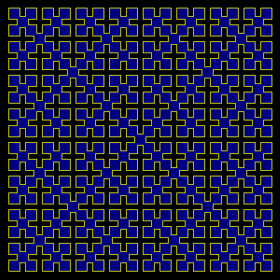

# Wirth Curve


The Wirth curve on its own fills a triangle 
shape. It is drawn four times (with a single join) to fill a square 
plane.

```logo
To New
 # set default screen, pen and turtle values
 ResetAll SetScreenSize [400 400] HideTurtle
 SetSC Black SetPC Green SetPS 1 PenUp
End
To Init :Order
 Make "Side (3*Power 2 :Order) - 1 # centre curve
 Make "Size 380/:Side # make Size a global value
End
To Wi :Order :Angle
 If :Order < 1 [Forward :Size Stop] # ie if = 0
 Right :Angle
 Iw :Order Minus :Angle
 Left :Angle Forward :Size Left :Angle
 Iw :Order Minus :Angle
 Right :Angle
End
To Iw :Order :Angle
 Right :Angle
 Wi :Order-1 Minus :Angle
 Forward :Size/2 Left 2*:Angle Forward :Size/2
 Wi :Order-1 Minus :Angle
 Right :Angle
End
To Go :Order
 New Init :Order
 SetPos List Minus 190 (Minus 190)+:Size/2
 SetPC Yellow PenDown
 Repeat 4 [Wi :Order 45 Forward :Size/2 Right 90 Forward :Size/2]
 PenUp Home SetPC DarkBlue Pendown Fill # comm out for no fills
End
```

Type **Go order** for example **Go 3** to run.

For an animation of Wirth Curves of orders 0-5.

```logo
To GoX
 New Animation
 For [Order 0 5] [Wash # comment out Wash for overlaid curves
 Init :Order
 SetPos List Minus 190 (Minus 190)+:Size/2
 SetPC Yellow PenDown
 Repeat 4 [Wi :Order 45 Forward :Size/2 Right 90 Forward :Size/2]
 PenUp Home SetPC DarkBlue Pendown Fill # comm out for no fills
 Refresh Wait 80 PenUp Home]
End
```
