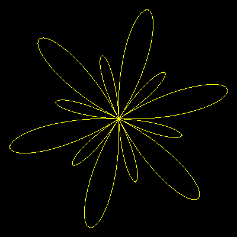

# Rose Curves


Rose curves are drawn by linking 
the Radius to the Sine of the Angle.

```logo
To New
 # set default screen, pen and turtle values
 ResetAll SetScreenSize [400 400] HideTurtle
 SetSC Black SetPC Green SetPS 1 PenUp
End
To Spiral :Angle
 # Rose curve
 Make "Radius 40 + 150*Sin(6*:Angle)
 Output P2R :Radius :Angle
End
To P2R :Radius :Angle
 Make "X :Radius * Cos :Angle
 Make "Y :Radius * Sin :Angle
 Output List :X :Y
End
To Go
 New SetPC Yellow
 For [Angle 0 360] [
 SetPos Spiral :Angle PenDown]
End
```

Try other values of multiple **:**Angle (shown in red) eg 2 7 or 8.

Adding an absolute command will produce seperate small petals. Try one of the following...

```logo
To Spiral :Angle
 # Rose curve 2
 Make "Radius Absolute 40 + 150*Sin(6*:Angle)
 Output P2R :Radius :Angle
End
To Spiral :Angle
 # Rose curve 3
 Make "Radius 40 + Absolute 150*Sin(6*:Angle)
 Output P2R :Radius :Angle
End
To Spiral :Angle
 # Carioid
 Make "Radius 90 * (1+Sin :Angle)
 Output P2R :Radius :Angle
End
To Spiral :Angle
 # Freeths Nephroid
 Make "Radius 60*(1+2*Sin :Angle)
 Output P2R :Radius :Angle
End
```
