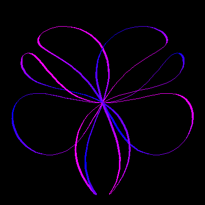

# Twisted Rose Curve


A series of twisted rose curves, with a Twist angle starting from 0 to 24 degrees.

```logo
To New
 # set default screen, pen and turtle values
 ResetAll SetScreenSize [400 400] HideTurtle
 SetSC Black SetPC Green SetPS 1 PenUp
End
To PtoR :RadDist :Theta
 # convert polar to rectangular co-ordinates
 LocalMake "X :RadDist *Sin :Theta
 LocalMake "Y :RadDist *Cos :Theta
 Output List :X :Y
End
To AngCol :Theta
 Make "Red Absolute 
 255*Cos :Theta
 Output ( List :Red 0 255 )
End
To Spiral :Angle :Twist
 # Twisted Rose Curves
 Make "Radius 180*Sin(4*:Angle)
 Make "Angle :Angle + 20*Sin :Twist*:Angle
 SetPW Width :Angle :Radius #comment out for plain pen
 SetPC AngCol 30 + 3*:Angle
 SetPos P2R :Radius :Angle PenDown Wait 2
End
To Width :Angle :Radius
 SetH Towards PtoR :Radius :Angle
 Output 2*(1.5+Sin (45 + 2*Heading))
End
To Go
 New
 For [Twist 0 24] [
 For [Angle 0 360] [
 Spiral :Angle :Twist] Wait 100 Wash]
End
```
