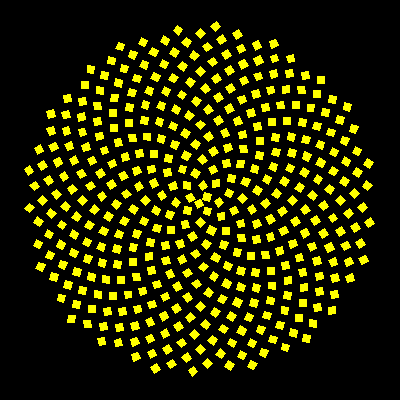

# Sunflower


Entwined left and right logarithmic spirals can be seen in the seed arrangemnets of many flowers, especially the Sunflower.   

In DrawSeed, comment in to fill seeds with color, or draw as thin lines instead.

```logo
To New
 # set default screen, pen and turtle values
 ResetAll SetScreenSize [400 400] HideTurtle
 SetSC Black SetPC Green SetPS 1 PenUp
End
To DrawSeed
 Left 45 PenDown Repeat 4 [Back 7 Right 90] PenUp
 # Right 45 Back 5 Fill # fill with yellow
 # PenDown Forward 16 PenUp # thin lines
End
To Go
 New SetPC Yellow
 For [Angle 200 90000 222.5] [ 
 # 222.5=360/1.618 Also try 445
 Make "Radius 0.6 * Power :Angle 0.5
 Home SetH :Angle Forward :Radius
 DrawSeed]
End
```
