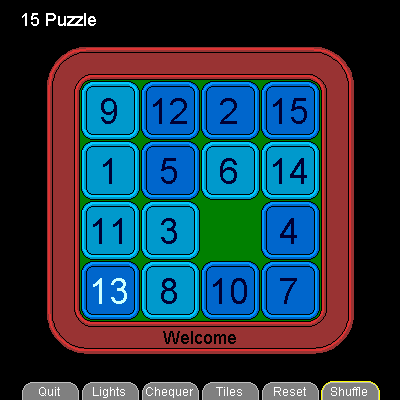

# 15 Puzzle


The classic 15 numbered tiles in a box.

**Instructions**  

Shuffle the tiles and attempt to return them to their initial positions.

**Controls** Mouse only - no keyboard  

Click a tile to slide it into an adjacent space  

Click the tabs below the puzzle for more game options

```logo
To New
 # set default screen, pen and turtle values
 ResetAll SetScreenSize [400 400] HideTurtle
 SetSC Black SetPC Green SetPS 1 PenUp
End
To Init
 Make "Home [1 2 3 4 5 6 7 8 9 10 11 12 13 14 15 0]
 Make "Tiles :Home
 Make "TileSets [
 [ [1 2 3 4 5 6 7 8 9 10 11 12 13 14 15 0] [Classic] ]
 [ [a b c d e f g h i j k l m n o 0] [Alphabet] ]
 [ [R A T E Y O U R M I N D P A L 0] [watch those A's !] ]
 [ [i ii iii iv v vi vii viii ix x xi xii xiii xiv xv 0] [Roman] ]
 [ [1 2 3 4 5 6 7 8 9 10 11 12 13 15 14 0] [impossible, 1 swop] ]
 [ [qq qr qs qt rq rr rs rt sq sr ss st tq tr ts tt] [Matrix] ] ]
 Make "TileSel 1 Make 
 "TileSet First (Item :TileSel :TileSets)
 Make "Tabs [ [Quit] [Lights] [Chequer] [Tiles] [Reset] [Shuffle] ]
 Make "GridPos False Make "Count 0
 Make "Light? False Make "Cheque? False
 Make "Shuffle? False Make "Win? False
End
To Title
 # write header
 SetPC White SetFontSize 18
 SetPos [-180 174] Label [15 Puzzle]
End
To Tabs
 For [M -1 4] [
 SetPos ScreenPos List :M 5
 SetPC Gray Button 56 11 Forward 14 SetPC [102 102 102] Fill
 Make "Lab Item (:M+2) :Tabs
 SetPC White SetFontSize 12
 SetX (First Pos) -1 - ((LabelLength :Lab)/2) SetY (Last Pos)
 Label :Lab Wait 4]
End
To Box
 Home
 SetPC [153 51 51] Button 306 40 Fill
 SetPC [222 51 51] SetPW 2 Button 301 38 SetPW 1
 SetPC Black Button 296 35 Button 242 14 Button 252 19
 SetPC [222 51 51] SetPW 2 Button 247 17 SetPW 1
 SetPC DarkGreen Fill
End
To Button :Size :Corner
 # rounded corner shape drawn from centre (tp)
 Back :Size/2 Right 90 Back :Size/2-:Corner PenDown
 Repeat 4 [Forward :Size-2*:Corner LeftArc 90 :Corner]
 PenUp Forward :Size/2-:Corner Left 90 Forward :Size/2 # return to centre
End
To LeftArc :Angle :Radius
 # arc drawn relative to turtle position, angle & radius positive
 PenUp Right 90 Back :Radius Left :Angle
 Arc :Radius Heading Heading+:Angle
 Forward :Radius Left 90 PenDown
End
To DrawGrid
 For [N 0 3] [
 For [M 0 3] [
 DrawTile List :M :N Wait 4] ]
End
To DrawTile :GridMN
 # draw tile at grid position
 SetPos ScreenPos :GridMN
 Make "Num TileNumber :GridMN
 SetPC DarkGreen Button 58 12 FillZone # erase tile
 If Not (:Num = 0) [
 Make "Icon Item :Num :TileSet
 SetPC Black Button 58 12
 If And :Cheque? OddTile :Num [
 SetPC [0 102 204] Make "Rim [0 153 255] ] [
 SetPC [0 153 204] Make "Rim [0 204 255] ]
 Fill
 SetPC Black Button 48 7
 SetPC :Rim SetPW 2 Button 53 10 SetPW 1
 If And :Light? (:Num = TileID :GridMN) [
 SetPC [204 255 255] ] [SetPC [0 0 51] ]
 SetFontSize 36
 SetX (First Pos) -1 - ((LabelLength :Icon)/2) SetY (Last Pos) - 14
 Label :Icon]
End
To OddTile :Num
 Make "Odd Member :Num [2 4 5 7 10 12 13 15]
 If :Odd = False [Output False] [Output True]
End
To TileNumber :GridMN
 Output Item TileID :GridMN :Tiles
End
To TileID :GridMN
 Output 1+(First :GridMN)+4*(Last :GridMN)
End
To ScreenPos :GridMN
 # return X Y screen position
 Make "X ((First :GridMN)*60) - 90
 Make "Y Minus (((Last :GridMN)*60) - 90)
 Output List :X :Y
End
To User
 Make "Input ReadMouse # wait for mouse input
 Make "MouseGP Gridd MousePos
 Make "NewGP :MouseGP
 If Not OverTiles :MouseGP [
 Make "NewGP False] [
 If (TileNumber :MouseGP) = 0 [
 Make "NewGP False] ]
 If OverTabs :MouseGP [
 Make "NewGP :MouseGP]
 If :Input = 0 [
 If :NewGP = :GridPos [Stop]
 If Not (:GridPos = False) [
 SetPC Black SetPos ScreenPos :GridPos Button 58 12 ]
 If Not (:NewGP = False) [
 SetPC Yellow SetPos ScreenPos :NewGP Button 58 12 ]
 Make "GridPos :NewGP ]
 If :Input = 1 [
 If :NewGP = False [Stop]
 If OverTabs :MouseGP [
 Run Item (2+(First :NewGP)) :Tabs ] [
 Make "BlankPos BlankNeigh :NewGP
 If :BlankPos = False [Stop]
 TileSwap :NewGP :BlankPos
 If Not :Win? [Counter]
 Make "GridPos False
 If And :Shuffle? (:Tiles = :Home) [
 Make "Win? True Halo Inform [!! Won !!]] ] ]
End
To Gridd :MsePos
 # return grid position from mousepos
 Make "M Round ((First :MsePos)+90) / 60
 Make "N Round ((Minus (Last :MsePos))+90) / 60
 Output List :M :N
End
To OverTiles :GridMN
 # return true if over tile area, else false
 If Or Or Or ((First :GridMN)>3) ((First :GridMN)<0)
 ((Last :GridMN)>3) ((Last :GridMN)<0) [
 Output False] [Output True]
End
To OverTabs :GridMN
 # return true if over tabs area, else false
 If Or Or ((First :GridMN)>4) ((First :GridMN)<-1) (Not (Last :GridMN)=5)
 [Output False] [Output True]
End
To BlankNeigh :GridMN
 #return position of blank neighbour, else False
 Make "Tile False
 Repeat 4 [
 Make "J Int Sin 90*RepCount Make "K Int Cos 90*RepCount
 Make "M (First :GridMN) +:J Make "N (Last :GridMN) +:K
 If (OverTiles List :M :N) [
 If (0 =TileNumber List :M :N) [Make "Tile List :M :N] ] ]
 Output :Tile
End
To TileSwap :Tile1 :Tile2
 Make "Num1 TileNumber :Tile1
 Make "Num2 TileNumber :Tile2
 Make "Tiles SetItem :Tiles (TileID :Tile1) :Num2
 Make "Tiles SetItem :Tiles (TileID :Tile2) :Num1
 DrawTile :Tile1
 DrawTile :Tile2
End
To Quit
 Inform [Thanks For Playing !]
 StopAll
End
To Lights
 Make "Light? Not :Light?
 DrawGrid
End
To Chequer
 Make "Cheque? Not :Cheque?
 DrawGrid
End
To Tiles
 Make "TileSel :TileSel+1
 If :TileSel > (Count :TileSets) [Make "TileSel 1]
 Make "TileSet First (Item :TileSel :TileSets)
 DrawGrid
 If Not :Win? [Inform Last (Item :TileSel :TileSets)]
End
To Reset
 ResetCounter
 Make "Shuffle? False
 Make "Tiles [0 0 0 0 0 0 0 0 0 0 0 0 0 0 0 0]
 DrawGrid
 Make "Tiles :Home
 DrawGrid
End
To Shuffle
 ResetCounter
 Make "Shuffle? True
 Repeat 16 [
 Make "Swap1 PickTile
 Make "Swap2 :Swap1
 While [:Swap1=:Swap2] [Make "Swap2 PickTile]
 TileSwap :Swap1 :Swap2]
End
To PickTile
 Make "Tile List Random 4 Random 4
 While [ (TileNumber :Tile) = 0] [Make "Tile List Random 4 Random 4]
 Output :Tile
End
To Counter
 # increment counter
 SetPC Black SetPW 18
 SetPos [170 180] PenDown SetX 188 PenUp SetPW 1
 SetPos [164 174] SetFontSize 12 SetPC White
 Make "Count :Count+1 Label :Count
End
To ResetCounter
 SetPC Black SetPW 18
 SetPos [170 180] PenDown SetX 188 PenUp SetPW 1
 Make "Count 0
 If :Win? [Make "Win? False Halo Inform Last (Item :TileSel :TileSets)]
End
To Inform :Info
 SetPos [-100 -138]
 SetPC [153 51 51] SetPW 20
 PenDown SetX 100 PenUp SetPW 1
 If :Win? [SetPC Yellow] [SetPC Black] SetFontSize 18
 SetPos List Minus((LabelLength :Info)/2) Minus 144
 Label :Info
End
To Halo
 If :Win? [SetPC Yellow] [SetPC Black]
 Home For [Size 315 355 10] [Button :Size 50]
End
To Go
 New Init Title Wait 20
 Box Wait 20 Tabs Wait 20 DrawGrid
 Inform "Welcome
 Forever [User]
End
```
