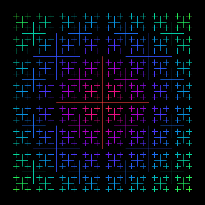

# Cross


A collection of recursive cross symbols. They are coloured depending on their distance from the central [0 0] point.

```logo
To New
 # set default screen, pen and turtle values
 ResetAll SetScreenSize [400 400] HideTurtle
 SetSC Black SetPC Green SetPS 1 PenUp
End
To Hue :Theta
 # Output RGB hue list from angle :Theta
 Make "Red Round 127.5*(1+Sin :Theta)
 Make "Green Round 127.5*(1+Sin (:Theta+120))
 Make "Blue Round 127.5*(1+Sin (:Theta+240))
 Output (List :Red :Green :Blue)
End
To Cross :Size
 If :Size < 6 [Stop]
 Repeat 4 [SetPC Hue Distance [0 0] PenDown Back :Size
 Left 90 PenUp Back :Size PenDown Cross :Size/2
 PenUp Forward :Size Right 90 Forward :Size Left 90]
End
To Go
 New Cross 90
End
```

For more recursions, reduce the size (shown in red) 
to 3.  

See [editing procedures](../../ipt/info/tuts.md).
