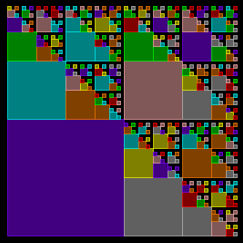

# Edge


A recursive edge of ever decreasing  tiles. There are 4 tile patterns, each with 8 random colors.

```logo
To New
 # set default screen, pen and turtle values
 ResetAll SetScreenSize [400 400] HideTurtle
 SetSC Black SetPC Green SetPS 1 PenUp
End
To Edge :Order :Side
 If :Order < 0 [Stop]
 SetX X -:Side/2 SetY Y -:Side/2
 # Right Integer 90 *Random 4 # random rotation
 SetPC Pick [1 2 3 6 9 13 14 15]
 Run List :Tile :Side
 SetPC Dark PenColor Fill
 SetY Y +:Side Edge :Order-1 :Side/2
 SetX X +:Side Edge :Order-1 :Side/2
 SetY Y -:Side Edge :Order-1 :Side/2
 SetX X -:Side/2 SetY Y +:Side/2
End
To Go :Order
 New
 Make "Side 192
 Repeat 4 [
 Wash SetPos [4 4] SetH 0
 Make "Tile Word "Tile RepCount
 Edge :Order :Side-1 Wait 180]
End
To Tile1 :Side
 # quater circle drawn from centre
 Right 45 Back :Side/1.42
 Arch 90 :Side Right 45 Forward :Side
 PenDown Back :Side Left 90 Forward :Side
 PenUp Back :Side Right 45 Forward :Side/1.42 Left 45
End
To Tile2 :Side
 # kite shape
 Right 45 Kite 1.4*:Side Left 45
End
To Tile3 :Side
 # lens shape
 Left 45 Lens 1.4*:Side Right 45
End
To Tile4 :Side
 # square shape
 Square :Side
 # Left 45 Square :Side/1.41 Right 45 # diamond shape
End
To Arch :Angle :Radius
 # symmetrical arc drawn relative to turtle heading
 Arc :Radius Heading-:Angle/2 
 Heading+:Angle/2
End
To Dark :Hue
 # output rgb list midway between :hue and black
 Repeat 3 [
 Make "Hue ButFirst LPut Int (First :Hue)/2 :Hue]
 Output :Hue
End
To Kite :Size
 # kite shape drawn from centre (tp)
 Back :Size/2 PenDown
 Left 18.4 Forward :Size/1.26 Right 63.4
 Forward :Size/2.82 Right 90 Forward :Size/2.82
 Right 63.4 Forward :Size/1.26
 PenUp Right 161.6 Forward :Size/2 # return to centre
End
To Lens :Size
 # lens shape drawn from centre (tp)
 Repeat 2 [
 Back :Size/2 Arch 90 :Size/1.414
 Forward :Size/2 Left 180]
End
To Square :Side
 # square (side x side) drawn from centre (tp)
 Back :Side/2 Right 90 Back :Side/2 PenDown
 Repeat 4 [
 Forward :Side Left 90]
 PenUp Forward :Side/2 Left 90 Forward :Side/2 # r2c
End
```
