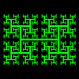
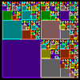
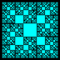
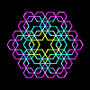
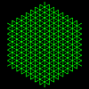
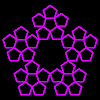
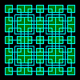
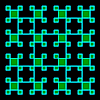

# Recur

## [Antenna Tree](anttree.md)

## [Circles](circles.md)

## [Cross](cross.md)

## [Edge](edge.md)

## [Golden Squares](goldsqrs.md)

## [Hexagons](hexagons.md)

## [Mesh](mesh.md)

## [Pentagons](pentagons.md)

## [Sphinx](sphinx.md)

## [Spinning Squares](spinningsqrs.md)

## [Squares (Centre)](squares.md)

## [Squares (Corner)](squaresv.md)

## [Binary Switch](switch.md)

## [Yin Yang](yinyang.md)

