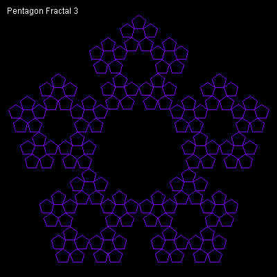

# Pentagons


A collection of recursive pentagon shapes. Increase the Order for more detail.

```logo
To New
 # set default screen, pen and turtle values
 ResetAll SetScreenSize [400 400] HideTurtle
 SetSC Black SetPC Green SetPS 1 PenUp
End
To Display :Order
 # write header title and curve level
 SetPC White SetPos [-190 180]
 Label Sentence [Pentagon Fractal] :Order
End
To Sier :Order :Side
 If :Order=0 [Pentagon :Side Stop]
 Repeat 5 [ Sier :Order-1 :Side*0.38
 PenUp Forward :Side PenDown Left 360/5 Wait 4]
End
To Pentagon :Side
 Repeat 5 [Forward :Side Left 360/5]
End
To Go :Order
 New Display :Order Home SetPC Purple
 Make "Side 232
 Back :Side/1.3 Right 90 Back :Side/2 PenDown
 Sier :Order :Side
End
```

Type **Go order** to run for example **Go 3** to run.

This similar code draws filled pentagons.

```logo
To New
 # set default screen, pen and turtle values
 ResetAll SetScreenSize [400 400] HideTurtle
 SetSC Black SetPC Green SetPS 1 PenUp
End
To Display :Order
 # write header title and curve level
 SetPC White
 SetPos [-190 180] Label Sentence [Pentagon Fractal] :Order
End
To Fill_In
 SetPC DarkBlue Left 22 Forward 5 Fill
 Back 5 Right 22 SetPC Brown
End
To Pentagon :Order :Side
 If :Order < 0 [Stop]
 Right 180
 Repeat 5 [
 PenDown Forward :Side Left 72
 Pentagon :Order-1 :Side/1.618]
 PenUp Fill_In
 Left 180
End
To Go :Order
 New Display :Order
 SetPC Brown Make "Side 64
 SetPos List Minus :Side/2 Minus :Side/1.3 Left 90
 Pentagon :Order :Side
End
```


Type **Go order** to run for example **Go 4** to run.
