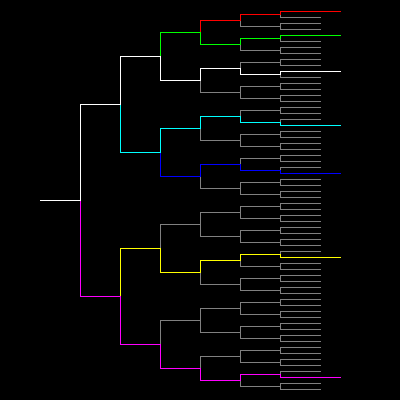

# Binary Switch


This shows a 1 to 64 demultiplexer  binary circuit. The input can be connected (or switched) to one of 64 outputs. The program draws seven random routings.

```logo
To New
 # set default screen, pen and turtle values
 ResetAll SetScreenSize [400 400] HideTurtle
 SetSC Black SetPC Green SetPS 1 PenUp
End
To Init
 PenUp Home Right 90 Back 160 PenDown
End
To Tree :Size
 Forward 40
 If :Size < 2 [Back 40 Stop]
 Left 90 Forward :Size Right 90 Tree 0.5*:Size
 Left 90 Back :Size*2 Right 90 Tree 0.5*:Size
 Right 90 Back :Size Left 90 Back 40
End
To Elec :Size
 Forward 40
 If :Size < 2 [Forward 20 Stop]
 SetH Pick [0 180] Forward :Size
 SetH 90 Elec 0.5*:Size
End
To Go
 New Init SetPC [128 128 128] Tree 96
 Make "Color 1 Repeat 7 [Init SetPC :Color Elec 96
 Make "Color :Color + 1 Wait 60]
End
```
