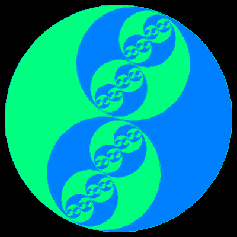

# Yin Yang


The famous yin yang symbol drawn in a recursive set of green and blue symbols.

```logo
To New
 # set default screen, pen and turtle values
 ResetAll SetScreenSize [400 400] HideTurtle
 SetSC Black SetPC Green SetPS 1 PenUp
End
To Yin :Size [:Parity 1]
 # yin shape drawn from centre (tp)
 # default parity of 1, use minus 1 for mirror image
 Make "Offset :Size/4 # global offset fill
 rArc 180 :Size/2 Back :Parity *:Size/4
 rArc 180 :Size/4 Back :Parity *:Size/2
 rArc 180 :Size/4 Back :Parity *:Size/4 Left 180
End
To YinYang :Size
 If :Size < 12 [Stop]
 Right 15 Repeat 2 [
 SetPC [0 192 192]
 Yin :Size Forward :Size/4
 If :Col = True [SetPC Aqua] [SetPC Leaf]
 Make "Col Not :Col
 Fill Wait :Size/6
 YinYang :Size/2
 Back :Size/4 Left 180] Left 15
End
To rArc :Angle :Radius
 # clockwise arc drawn relative to turtle heading
 Arc :Radius Heading :Angle+Heading Right :Angle
End
To Aqua
 Output [0 128 255] # return aqua rgb color
End
To Leaf
 Output [0 255 128] # return leaf rgb color
End
To Go
 New Make "Col True
 YinYang 384
End
```
