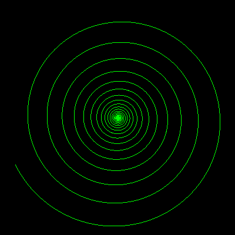

# Spirals


All these spirals are drawn using calculation of curvature. See [PolarSpirals](../polar/polarspirals.md) for spirals drawn using polar co-ordinates.

This draws an Archimedes (circle involute κ = κ (1/sqrt s) ) spiral where N is the number of turns. eg Go 30 for a 30 turn spiral.

```logo
To New
 # set default screen, pen and turtle values
 ResetAll SetScreenSize [400 400] HideTurtle
 SetSC Black SetPC Green SetPS 1 PenUp
End
To Go :N
 New PenDown
 Repeat :N * 360 [Forward 1 Right :N / SqRt RepCount]
End
```

Type **go :N** to run.

For a logarithmic or equilateral spiral, κ = κ (1/s) .  

N is the number of turns. eg Go 14 for a 14 turn spiral.

```logo
To New
 # set default screen, pen and turtle values
 ResetAll SetScreenSize [400 400] HideTurtle
 SetSC Black SetPC Green SetPS 1 PenUp
End
To Go :N
 New PenDown
 Repeat :N * 360 [Forward 1 Right 1500 / RepCount]
End
```


Type **go :N** to run.
