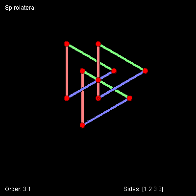

# SpiroLaterals


Spirolaterals are created by repeating a set number of 'move forward 
and turn' commands. Turn angle can be positive or negative.

```logo
To New
 # set default screen, pen and turtle values
 ResetAll SetScreenSize [400 400] HideTurtle
 SetSC Black SetPC Green SetPS 1 PenUp
End
To Spir
 Make "ItemNum 1
 Repeat :Order [
 Repeat (:Order + :L) [
 Make "Dist :Size * (Item :ItemNum :Sides)
 Ribbon :Dist Wait 6
 Back :Dist Pin Forward :Dist
 If :ItemNum < (:Order + :L)
 [Make "ItemNum :ItemNum +1] [Make "ItemNum 1]
 Right :Angle ] ]
 Pin SetPC DarkRed SetPW 
 1 Circle 2
End
To Init
 Make "Sides [ ]
 Make "Order Pick [3 4 5 6]
 Make "Size Integer (340 / Power :Order 2)
 Make "Angle 360 / :Order
 Make "L Pick [1 -1]
 Repeat (:Order+:L) [
 Make "Sides LPut Pick [ -5 -4 -3 -2 -1 0 1 2 3 4 5] :Sides ]
End
To Display
 # write header title and footer values
 SetPC White
 SetPos [-190 180] Label "Spirolateral
 SetPos [-190 -190] Label ( List "Order: :Order :L )
 SetPos [52 -190] Label ( List "Sides: :Sides )
End
To Ribbon :Dist
 SetPC Hue2 Heading/2
 SetPenWidth 5 PenDown Forward :Dist
 PenUp Left 90 Forward 3 Left 90
 SetPC Black SetPenWidth 1 PenDown Forward :Dist
 PenUp Left 90 Forward 6 Left 90
 PenDown Forward :Dist
 PenUp Left 90 Forward 3 Right 90
End
To Pin
 SetPC Red SetPW 11 Dot Pos
 SetPC DarkRed SetPW 1 Circle 5.4
End
To Hue2 :Theta
 # Output RGB hue list from angle :Theta
 Make "Red Abs 255*Sin :Theta
 Make "Green Abs 255*Sin (:Theta+120)
 Make "Blue Abs 255*Sin (:Theta+240)
 Output (List :Red :Green :Blue)
End
To Go
 New
 Repeat 12 [
 Wash Init Display Home
 Spir Wait 200]
End
```
