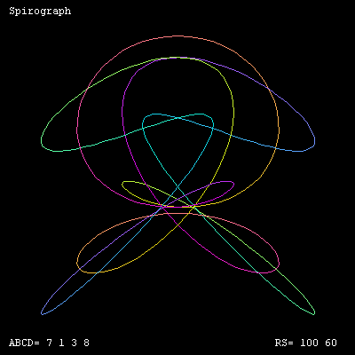

# Spiro


This program draws a series of 
12 random Spirograph-like patterns. Type in **Go** again to see 
12 more.

```logo
To New
 # set default screen, pen and turtle values
 ResetAll SetScreenSize [400 400] HideTurtle
 SetSC Black SetPC Green SetPS 1 PenUp
End
To Spir
 SetPos XYCurve 0 PenDown
 For [T 1 360] [SetPC Hue2 :T SetPos XYCurve :T]
End
To Rand
 Make "R Pick [80 90 100 110 120]
 Make "S 160-:R
 Make "A (1 + Random 9)
 Make "B (1 + Random 9)
 Make "C (1 + Random 9)
 Make "D (1 + Random 9)
End
To Display
 # write header title and footer values
 SetPC White
 SetPos [-190 184] Label "Spirograph
 SetPos [-190 -190] Label ( List "ABCD= :A :B :C :D )
 SetPos [110 -190] Label ( List "RS= :R :S )
End
To Hue2 :Theta
 # Output RGB hue list from angle :Theta
 Make "Red Abs 255*Sin :Theta
 Make "Green Abs 255*Sin (:Theta+120)
 Make "Blue Abs 255*Sin (:Theta+240)
 Output (List :Red :Green :Blue)
End
To XYCurve :T
 Make "X :R*(Sin :A*:T) + :S*(Sin :B*:T)
 Make "Y :R*(Cos :C*:T) + :S*(Cos :D*:T)
 Output (List :X :Y)
End
To Go
 Repeat 12 [ New Rand Display Spir Wait 200]
End
```

Paste any **one** of the following 'XYCurves' into XLogo to generate 
a different set of spirograph patterns.

```logo
To XYCurve :S :T
 # spiros
 Make "X :R*(Cos :A*:T) + :S*(Sin :B*:T)
 Make "Y :R*(Sin :C*:T) + :S*(Cos :D*:T)
 Output List :X :Y
End
To XYCurve :S :T
 # flowers -note C & D not used
 Make "X :R*(Cos :A*:T) + :S*(Sin :B*:T)
 Make "Y :R*(Sin :A*:T) + :S*(Cos :B*:T)
 Output List :X :Y
End
```

Change the red + to a - for two more XYCurves.
