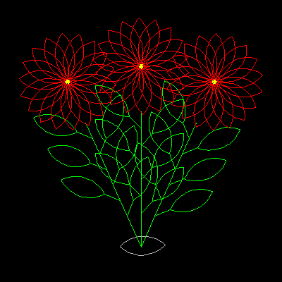

# Art Works

| A set of general art programs which, simply, do not fit into any of the other sections. Some images are generated randomly, and so will produce a different 
work of art each time. Note thatIceandFieldshave very similar codes. BorderDouble border frame.Cardioid CurveCircles of touching radii.Clover ArtRandom clover leaf/wave shapes.CondensationExpanding water droplets.EyeRandom filled sector shapes. | FieldsFields of random stress lines.FlowersA bunch of flowers demonstrating good use of procedures.IceRandomly cracked ice sheet.PetalsA series of 7 flowers.Shapes ConfettiRandom pile of colored shapes.Wire ShapesA random collection of wires. |
