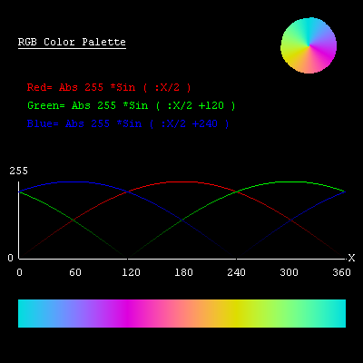

# Coding

| These programs help in some aspects of coding and the creation of more programs. 
They are kind of XLogo utilities.
Some are also shown in the galleries. CharactersDraw font characters.ChequerDemo column by row grid.DotsFill screen with random dots. | RGB ColorsSee the color effects of different AngCol procedures.RGB SwatchesArray of RGB color values.ShapesOutline shapes with labelled arch and arcs.SwatchesXLogo colors 0 to 16.TrackerOn screen tracking of any program variable.X HairAdd a X-Hair to any XLogo program. |
