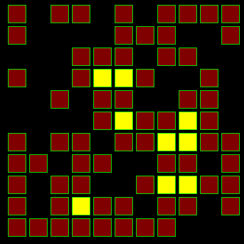

# Grids

| These programs are all based on a strong grid structure of vertical 
and horizontal lines. A grid is created by using a pair of nested loops. These generate 
the XY co-ordinates of each cell within the grid. CubesCubic art sculpture.DrainWater drainage systems.Elastic GridsMathematically distorted grids.Grid ArtA regular array of assembled squares. | HexagramsAncient chinese binary fortune telling.LED DisplayScrolling dot matrix text.MazeSelf creating random mazes.Oct TilesRandom pattern edge matching tiles.Surface3D surface grids.Tile ArrayVarious tile arrays.Tile PatternVarious tile patterns. |
