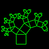

# Tree

## [Kite Tree](kitetree.md)

## [Leaning Tree](leaning.md)

## [Lune Tree](lune.md)

## [Basic Tree](tree1.md)

## [Random Trees](tree2.md)

## [Tree Generator](tree3.md)

## [Recursive Tree](treeanim.md)

## [Triangular Tree](tritree.md)

