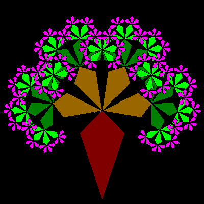

# Kite Tree


Similar to the Lune Tree this is drawn using the kite shape. To ensure 
shapes overlap correctly, the tree is drawn in increasing depths from 
1 to :Order.

```logo
To New
 # set default screen, pen and turtle values
 ResetAll SetScreenSize [400 400] HideTurtle
 SetSC Black SetPC Green SetPS 1 PenUp
End
To Init
 # make Angle and Scale global values
 GlobalMake "Angle 54
 GlobalMake "Scale 1.79
End
To Tree :Order :Size
 If :Order <0 [Stop] # end recursion if order <0
 If :Order =0 [DrawKite :Size] [Forward :Size] # draw kite if order =0
 Left 1.5*:Angle Tree :Order-1 :Size/:Scale
 Right :Angle Tree :Order-1 :Size/:Scale
 Right :Angle Tree :Order-1 :Size/:Scale
 Right :Angle Tree :Order-1 :Size/:Scale
 Left 1.5*:Angle Back :Size
End
To DrawKite :Size
 Forward :Size/2 Make "Col PenColor
 SetPC White Kite :Size FillZone SetPC :Col Fill
 SetPC Black Kite :Size SetPC :Col
 Forward :Size/2
End
To Kite :Size
 # kite shape drawn from centre (tp)
 Back :Size/2 PenDown
 Left 18.4 Forward :Size/1.26 Right 63.4
 Forward :Size/2.82 Right 90 Forward :Size/2.82
 Right 63.4 Forward :Size/1.26
 PenUp Right 161.6 Forward :Size/2 # return to centre
End
To Go :Order
 New Init
 For (List "Ord 0 :Order) [
 Home Back 192
 SetPC Run Item :Ord+1 [DarkRed Brown DarkGreen Green Magenta Cyan]
 Tree :Ord 175]
End
```
