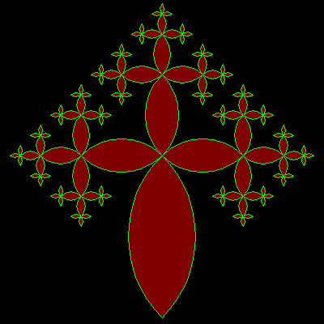

# Lune Tree


Trees are drawn using 'lunes', a lobe like shape. This gives quite a 
different appearance and a continueous curve through the tree branches. 
Lunes are used matching the branch angle of 60 or 90 degrees.

```logo
To New
 # set default screen, pen and turtle values
 ResetAll SetScreenSize [400 400] HideTurtle
 SetSC Black SetPC Green SetPS 1 PenUp
End
To Init
 # make Angle and Scale global values
 GlobalMake "Angle 90
 GlobalMake "Scale 2
End
To Tree :Size :Order
 If :Order < 0 [Stop] # ends recursion if order < 0
 Forward :Size/2
 Left 90 Lens :Angle :Size Right 90
 SetPC DarkRed Fill SetPC Green
 Forward :Size/2 Left :Angle
 Tree :Size/:Scale :Order-1 Right :Angle
 Tree :Size/:Scale :Order-1 Right :Angle
 Tree :Size/:Scale :Order-1 Left :Angle
 Back :Size
End
To Arch :Angle :Radius
 # symmetrical arc drawn relative to turtle heading
 Arc :Radius Heading-:Angle/2 
 Heading+:Angle/2
End
To Lens :Size
 # lens shape drawn from centre (tp)
 Repeat 2 [
 Back :Size/2 Arch 90 :Size/1.414
 Forward :Size/2 Left 180]
End
To Go :Order
 New Init Back 192
 Tree 200 :Order
End
To GoX
 New Init Left 45 Repeat 4 [
 Tree 140 4 Right 90]
End
```

Type **gox** or **go order** for example **go 3** to run.

Just a few changes produces a 60 degree angle tree.

```logo
To New
 # set default screen, pen and turtle values
 ResetAll SetScreenSize [400 400] HideTurtle
 SetSC Black SetPC Green SetPS 1 PenUp
End
To Init
 # make Angle and Scale global values
 GlobalMake "Angle 60
 GlobalMake "Scale 1.5
End
To Tree :Size :Order
 If :Order < 0 [Stop] # ends recursion if order < 0
 Forward :Size/2
 Left 90 Lens60 :Angle :Size Right 90
 SetPC DarkRed Fill SetPC Green
 Forward :Size/2 Left :Angle
 Tree :Size/:Scale :Order-1 Right 2*:Angle
 Tree :Size/:Scale :Order-1 Left :Angle
 Back :Size
End
To Arch :Angle :Radius
 # symmetrical arc drawn relative to turtle heading
 Arc :Radius Heading-:Angle/2 
 Heading+:Angle/2
End
To Lens60 :Size
 # lens shape drawn from centre (tp)
 Repeat 2 [
 Back :Size Arch 60 :Size
 Forward :Size Left 180]
End
To Go :Order
 New Init Back 160
 Tree 128 :Order
End
To GoX
 New Init Back 15 Repeat 3 [
 Tree 86 4 Right 120]
End
```


Type **gox** or **go order** for example **go 3** to run.
